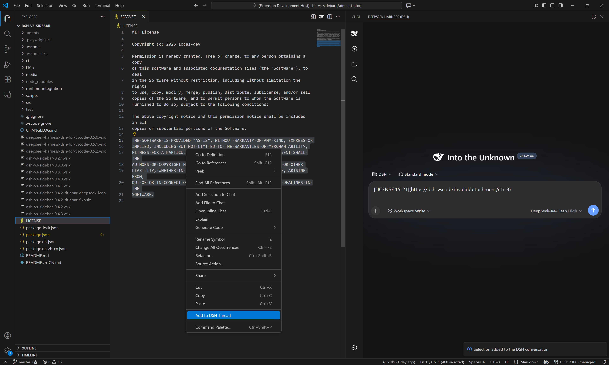

# DSH for VS Code

[English](README.md) · [简体中文](README.zh-CN.md)

Embeds the local [DeepSeek Harness](https://github.com/deepseek-ai/deepseek-harness) (DSH) web UI in the VS Code auxiliary sidebar (right rail, alongside Copilot Chat). By default, every VS Code window starts and owns one `dsh web` child with the current workspace as cwd, then renders it in a compact full-screen iframe.

## ✨ **What's new in 1.0.0**

> [!NOTE]
> **Fixed: managed startup no longer breaks on DSH runtimes older than 0.1.0-rc.7.** The `--no-open` flag is now gated on the runtime version, and a runtime that still rejects it is automatically retried once without the flag — the sidebar starts instead of silently dying.
>
> **Windows: DSH is found in far more places.** Discovery now also scans PATH shims (`dsh.cmd` / `dsh.ps1`) and the pnpm / yarn / scoop / volta global layouts, so installations outside the classic npm layout are picked up automatically — no settings required.
>
> **New settings:** `dsh.executablePath` (package dir, `lib/bin.js`, or a Windows shim — your choice wins over auto-detection), `dsh.launch.method` (`auto` / `managed` / `command`), `dsh.launch.command`, and `dsh.extraArgs` (extra CLI flags appended to every managed launch).
>
> **Connection watchdog:** once the sidebar is connected, the service endpoint is monitored; if it stops answering (crash, sleep/resume, port hijack), the sidebar shows a connection-lost page with one-click Retry instead of a dead frame.
>
> **Smarter reuse:** when the configured port is silent but a `dsh web` is already running on another port of this machine, the extension discovers it from the process list and binds to it.

## **VS CODE INTERACTION GUARANTEE (0.9.0)**

**In an extension-owned DSH session, model-output Copy **and native ⌘C/⌘X/⌘V (Ctrl+C/X/V) inside the embedded page** use the VS Code clipboard—including selections inside the chat composer—, `Read …` files—including absolute paths from shared older sessions outside the current workspace—open in the exact owning VS Code window, and HTTP/HTTPS links open in VS Code Simple Browser. The embedded page follows the VS Code color theme (light/dark) instead of the OS. Markdown files no longer fall through to Windows file associations such as Typora. Right-click the editor body to add either the whole file (`Add File to DSH Thread`, no selection required) or the current selection (`Add to DSH Thread`); both append only a compact Markdown file/link to the active DSH draft—never the selected source text. Clicking the rendered link reopens that approved file/selection in the owning VS Code window. Nothing is ever auto-sent.**

## Selection-link example

Select one or more code ranges, right-click **Add to DSH Thread**, and the DSH draft receives compact file-and-line Markdown links instead of pasted source code. The screenshot shows two selections queued in the same draft.



## 🚨 **IMPORTANT: ISOLATED MODE CAN MAKE ALL EXISTING MODULES APPEAR TO DISAPPEAR**

> [!IMPORTANT]
> **The default is `dsh.home.mode: shared` (since 0.6.0): the extension directly uses the official DSH home (`DSH_HOME`, otherwise `~/.dsh`). Existing modules, skills, providers, credentials, presets, and sessions are therefore shared with standalone DSH.**
>
> Set `dsh.home.mode` to `isolated` only when this VS Code extension needs a completely separate module configuration. Isolated mode uses the extension's private `globalStorage/.dsh`, initially containing only the official `web` profile. Switching modes can therefore make every module appear to disappear, but nothing is deleted—the data remains in the other DSH home. The extension never copies or merges the two homes.
>
> On the first upgrade from 0.4.x, a non-empty legacy isolated home is preserved automatically unless you already selected a mode. Use **DSH: Diagnose** to see the effective mode and path, then switch to `shared` explicitly when ready.

Starting `dsh web` with VS Code when `dsh.autoStart=true` is intentional. Runtime binaries and DSH user data are independent: both the local official npm package and a manifest/SHA-256-verified managed runtime use the selected shared/isolated home.

## Requirements

| Item | Requirement |
|---|---|
| VS Code | ≥ 1.106, desktop only |
| DSH (default auto-start) | `npm install -g @deepseek-ai/dsh`; the extension detects the official package |
| Node.js | auto-detected; set `dsh.local.nodePath` for non-standard locations |
| DSH configuration | no pre-creation needed; shared mode creates/reuses official `~/.dsh`, isolated mode creates the extension-private home |

## Install

- Dev: open this repo → `F5` → **Run Extension**
- Verify: `npm ci` → `npm run check:w0` → `npm run test:extension-host`
- Secret scan: `npm run test:secrets` scans the source/docs that would enter the VSIX (never `node_modules`, `.git`, or `.vscode-test`) and exits 1 on hardcoded bridge tokens, `Authorization: Bearer` credentials, API keys, private keys, or password literals; example/test fixtures are released with an explicit `// allow-secret-scan` comment.
- Package: `npm i -g @vscode/vsce && vsce package --no-dependencies` → `code --install-extension dsh-vs-sidebar-1.0.0.vsix`

## Usage

- `Ctrl+Alt+B` opens the auxiliary sidebar → **DeepSeek Harness (DSH)** tab
- Opt-in `Ctrl+L` (`Cmd+L` on macOS): with `dsh.keybindings.ctrlL` enabled, pressing it in the editor adds the active selection to the DSH conversation
- Opt-in `Ctrl+I` (`Cmd+I` on macOS): with `dsh.features.ctrl-i` enabled, run **Edit with DSH Files (Ctrl+I)**; pick 1–8 workspace files in the QuickPick and the multi-file context block is sent to the DSH conversation. No default keybinding is contributed.
- Opt-in `Ctrl+K` (`Cmd+K` on macOS): with `dsh.features.ctrl-k` enabled, select code and run **Edit with DSH (Ctrl+K)**; type an instruction and the selection+instruction draft is sent to the DSH conversation. No default keybinding is contributed — add one yourself:
  ```json
  { "key": "ctrl+k", "command": "dsh.ctrlKEdit", "when": "editorTextFocus && editorHasSelection" }
  ```
  (macOS: use `"key": "cmd+k"`)
- Commands (command palette): **Open DSH in Browser** · **New Session** · **Switch Session** · **Open Session History** · **Restart DSH Server** · **Restart DSH Server Cleanly** · **Stop DSH Server** · **Focus DSH Sidebar** · **Add File to DSH Thread** · **Add Folder to DSH Thread** · **Add to DSH Thread** · **Add Active File to DSH Context** · **Add Active Selection to DSH Context** · **Add Problems to DSH Context** · **Capabilities and Integrations** · **Diagnose** · **Clean Up Orphan DSH Servers** · **Set up DSH** · **New DSH Instance** · **DSH Changes** · **Set DSH FIM API Key**
- With `dsh.autoStart` on, the server is started at VS Code startup even if the sidebar is never opened
- Extra surfaces: run **DSH: New DSH Instance** (or enable the sidebar title-bar entry with `dsh.multiInstance.entry`) to open another DSH panel in the editor area. All surfaces share the window's single DSH process; each panel gets its own DSH session (`dsh_session`), and closing a panel releases that session only
- Model routing (L2, off by default): set `dsh.lm.route` to `fixed` or `dynamic` (with `dsh.features.lm-route`) and DSH models appear in the VS Code language-model chat picker as vendor `dsh`, served through bridge-token-authenticated `/api/lm` routes — never through Copilot quota
- MCP consumption (L2, off by default): with `dsh.features.mcp-consume` enabled, DSH can use the VS Code-side MCP servers configured in the DSH profile through `vscode/mcp/*` bridge methods; every server/tool call passes the consent gate (**DSH: Refresh MCP Servers** / **DSH: Forget MCP Consent**)
- Changes review (L2, off by default): with `dsh.features.changes-review` enabled, workspace edits pushed by DSH appear in the **DSH Changes** tree with open-diff / accept / undo actions and approval prompts before any file is touched

> **Restart DSH Server Cleanly** disables every non-core (non-`@deepseek-ai/*`, non-embed) plugin in the active profile via `vscode-clean.overlay.yml` before restarting. When startup fails with `HEALTH_TIMEOUT` or `SPAWN_EXITED_EARLY`, the status page offers a **Restart-Clean** entry; in clean mode it shows a banner with **Restart-normal**, which restarts with the normal embed overlay. A startup that exits early while a `--patch` overlay is in effect automatically retries exactly once without the patch (recorded in Diagnose).

## First-run setup (onboarding)

On the first activation the extension asks **“DSH is ready — set it up?”** with three choices: **Set up** opens a multi-step wizard, **Not now** asks again on the next activation, and **Never** stops asking (until the command is run). The wizard walks through the **profile** (default `web`, validated against `^[A-Za-z0-9._-]{1,64}$`; a change takes effect after reloading the window), **auto-start**, **close policy**, an informational **watchdog / roadmap** step (display-only; opt-in L2 features such as multi-instance, Tab completion, MCP, and model routing are listed as switches you enable later in Settings), the implemented **DSH feature switches**, and a **summary** to confirm. Every accepted step writes its `dsh.*` setting immediately (global scope), so skipping a step keeps its current value. All copy is bilingual through the `vscode.l10n` bundle. Re-run the wizard at any time with the **Set up DSH** command, and change individual values later in Settings (`dsh.*`).

## Session navigation

**New Session** / **Switch Session** / **Open Session History** use DSH's local session API. **Switch Session** shows a QuickPick with each root session's title, workspace path, update time, and running state; selecting one reloads the iframe with the `dsh_session` query parameter so the DSH web UI opens that session. **Open Session History** is the same picker under the `dsh.features.chat-participant` gate, and exits with a warning when no server or no session is available. The extension does not keep a second session tree — the DSH server remains the source of truth. **New Session** creates a session for the current workspace root and, when one already exists, reuses a blank session for the same cwd instead of creating a duplicate.

## Chat participant (@dsh)

With `dsh.features.chat-participant` enabled (L2, default off), the extension contributes the **@dsh** participant to the VS Code chat view. Type `@dsh` followed by your prompt: the participant resolves the current workspace DSH session, enqueues the prompt (`session.prompt`, mode `queue`), and streams the DSH session's text deltas back into the chat response. Follow-ups offer up to five recent root sessions for one-click continuation.

**D9 boundary**: the participant never reads `request.model` and never consumes the `vscode.lm` / Copilot quota — it talks only to the DSH-owned session API on the local loopback server.

## Tab completion (FIM POC)

With `dsh.features.tab-completion` enabled (L2, default off), the extension registers an inline completion provider for `file`-scheme documents and injects a per-window `DSH_FIM_BRIDGE_TOKEN` into the managed DSH child so the DSH-side vscode-fim plugin's `/api/fim` endpoint only answers this window.

This is a **POC-grade** feature. If it does not meet the D13 quality bar it will be removed as a whole rather than shipped in a half-broken state.

- **Model selection**: the DSH-side vscode-fim plugin owns `fimApi` / `fimBaseUrl` / `fimModel`; the extension side only selects the model through `dsh.fim.model` (machine scope).
- **API key**: set it with the **Set DSH FIM API Key** command; it is stored in VS Code `secretStorage` (`dsh.fim.apiKey`), never in `dsh.*` configuration.
- **Default off**: zero registration and zero spawn-env injection while the feature is disabled.

## Editor context (explicit attachment)

Right-click the editor body and choose **Add File to DSH Thread** (no selection required) or, with a selection, **Add to DSH Thread**. Both focus the DSH sidebar and append only a Markdown link such as `[app.js](…)` / `[app.js:5-8](…)`; no source text is pasted into the draft. After the message is rendered, clicking the link reopens the approved file range in the owning VS Code window. Existing draft text is preserved, and the extension does not send automatically.

Right-click a **folder** in the Explorer and choose **Add Folder to DSH Thread**. The draft receives only a compact folder link; DSH reads back a bounded listing of relative paths (depth ≤ 2, at most 500 entries, skipping `node_modules`, `.git`, and hidden entries) through the same attachment channel — never the folder's file contents. Clicking the rendered link reveals the folder in the Explorer (`revealInExplorer`), available on every platform.

**Add File to DSH Thread** and **Add Folder to DSH Thread** are the only commands that may attach a trusted `file://` document/folder located outside the open workspace folders (for example a file opened via `File > Open File…`, or a trusted folder). That explicit-user-action approval only applies to the command itself and to the produced attachment link; the versioned bridge's `open`, `openDiff`, and wire-supplied diagnostics requests remain workspace-only, and `Add Active File / Selection / Problems` keep their implicit-attachment workspace gate.

The extension never sends editor content implicitly. The active file, selection, folder listing, and Problems stay out of DSH until you run one of the **Add …** commands; the resulting attachment is the only thing the `vscode_editor` tool can read back through the versioned bridge.

- File, selection, folder, and Problems attachments are window-memory only and are cleared when the workspace root changes.
- Attachments over 1 MiB (UTF-8) are rejected instead of silently truncated; diagnostics are capped at 1000 items and 2000 chars per message; folder listings are capped at 2 levels / 500 entries.
- Bridge `open`/`openDiff`/wire-supplied diagnostics only accept `file` URIs inside an open, trusted workspace folder — the bridge exposes no arbitrary command, URI, or file read.
- DSH receives `vscode/contextChanged` notifications carrying revision and attachment ids only, never content. CH1 v2 adds metadata-only `selectionChanged` / `activeEditorChanged` / `diagnosticsChanged` notifications, validated against `V2_NOTIFICATION_SCHEMA` at the host boundary.

## Exports API

When `dsh.features.exports` is enabled, the extension's `activate()` function returns a frozen programmatic face (`version: "1"`) with three methods:

| Method | Signature | Description |
|---|---|---|
| `ask` | `ask(prompt, opts?) → Promise<{accepted: true, sessionId}>` | Enqueue a prompt into the current workspace session. `prompt` is a non-empty string of at most 100000 characters; `opts.sessionId` (defaults to the current workspace session), `opts.mode` (`"queue"` or `"steer"`), `opts.signal` (AbortSignal). |
| `listSessions` | `listSessions(opts?) → Promise<Array<object>>` | List DSH sessions through the session API; `opts.signal` is forwarded. |
| `addContext` | `addContext(uri, range?) → Promise<{id, kind, uri}>` | Attach one `file://` URI (string or `vscode.Uri`) to the current context. A trailing `/` routes to a folder attachment; `range` is `{start:{line,character}, end:{line,character}}` for file attachments. |

Stable error codes (`DshExportError.code`): `DSH_EXPORT_DISABLED`, `DSH_EXPORT_NO_SERVER`, `DSH_EXPORT_INVALID_PROMPT`, `DSH_EXPORT_INVALID_URI`, `DSH_EXPORT_OUTSIDE_WORKSPACE`, `DSH_EXPORT_TOO_LARGE`, `DSH_EXPORT_TOO_MANY_FILES`.

v1 boundaries:

- **No streaming**: `ask` returns `{accepted: true, sessionId}` only; there is no SSE/text-delta streaming surface.
- **`addContext` is bounded**: one URI per call; editor-context budgets still apply (files over 1 MiB are rejected instead of truncated).
- **L2 default off**: the face exists with `dsh.features.exports` off so third parties can depend on the stable shape, but every method call throws `DSH_EXPORT_DISABLED` until the setting is enabled.
- **Breaking changes require a major version**: the face is frozen at `version: "1"`; method removal/signature changes must ship as a new major.
- **Third-party enablement**: consumers set `dsh.features.exports` to `true` (machine scope) in settings, then read the returned face from `activate()`.

## Capabilities & diagnostics

**Capabilities and Integrations** focuses the DSH sidebar and opens the capability center in the DSH web UI. The extension ships a small controlled provider catalog (`src/capabilityCatalog.js`) and a provider detector (`src/providerDetector.js`) that reports install/enable state for four framework candidates only:

- Remote development: `ms-vscode-remote.remote-wsl`, `ms-vscode-remote.remote-ssh`
- GitHub: `GitHub.vscode-pull-request-github`
- Browser: `browser-provider-placeholder` (framework placeholder until the W5 browser provider is selected and verified)

The extension never installs third-party providers. **Every third-party provider is `manual-assist` in this round**; none is marked `integrated` because the stable-interface audit (G3) is still open. `vscode/extensions/openDetails` only opens the catalog-controlled VS Code extension details page or an official `https://` documentation page — there is no install code path.

**Diagnose** reads the `dsh.*` configuration, server state, bridge state, catalog revision, and provider detection results, then shows a single summary message. Diagnostics are also mirrored to the **`DSH` OutputChannel** (VS Code → Output → DSH) — the last link of the failure-degradation chain — including feature failures, startup errors, self-heal events and orphan-sweep events.

## Workspace & bridge capabilities (0.6–0.9)

- **Plugin catalog** (`src/catalog/*`, `src/detection/*`, `src/diagnose/*`): a schema-validated catalog contract describes DSH plugin categories/entries, and the L3 probe detects installed plugins in the selected DSH home. `Diagnose` includes the plugin summary.
- **Workspace registry** (`src/context/workspaceBinding.js`, `src/ch2/workspaceClient.js`): the sidebar binds VS Code workspace roots through DSH's `workspace.list/create` API. Switching the active workspace root rebinds the DSH session through the registry — the owned child process is **not** killed or restarted. Owned servers auto-create the workspace record; reused servers ask for consent.
- **CH1 v2** (`src/protocol/ch1.js`, `src/ch1/notifier.js`): the versioned bridge negotiates protocol v1/v2 and adds metadata-only `selectionChanged` / `activeEditorChanged` / `diagnosticsChanged` notifications, coalesced by a 150 ms notifier and validated against `V2_NOTIFICATION_SCHEMA`.
- **Command shell** (`src/commands/shell.js`, `src/commands/addFileToThread.js`): a capability-router gate for commands; `dsh.addFileToThread` is the first command wired through it.

Provider state is refreshed through `vscode.extensions.onDidChange`, which emits `vscode/providerStatesChanged` notifications on the versioned bridge. Detection re-reads `vscode.extensions` on every call and never caches state across workspaces.

## VS Code bridge capabilities & roadmap

The versioned bridge (`versionedBridgeServer` + CH1 protocol, v1→v3 negotiated) is the channel DSH uses to reach the VS Code window. Always-on methods stay read/open-only and are guarded by workspace trust plus per-window loopback tokens; every capability that touches terminals, UI surfaces, editor buffers or cross-extension calls ships **off by default** behind an explicit `dsh.bridge.*` / `dsh.features.*` consent switch.

### Exposed to DSH (always on)

| Type | Exposed methods / notifications |
|---|---|
| Editor read | `vscode/editor/getContext` |
| Open file | `vscode/editor/open` |
| Open diff | `vscode/editor/openDiff` |
| Diagnostics | `vscode/workspace/getDiagnostics` |
| Extension / provider | `vscode/extensions/getProviderStates` · `vscode/extensions/openDetails` · `vscode/extensions/list` |
| Workspace search | `vscode/workspace/findFiles` |
| Notifications (v1) | `vscode/contextChanged` · `vscode/providerStatesChanged` · `vscode/workspaceChanged` |
| Notifications (v2) | + `vscode/editor/selectionChanged` · `vscode/editor/activeEditorChanged` · `vscode/diagnosticsChanged` |

### Exposed to DSH behind consent switches (v3, default off)

| Switch | Capability family |
|---|---|
| `dsh.bridge.terminal` | `vscode/terminal/create` · `vscode/terminal/sendText` · `vscode/terminal/read` — integrated terminals created/sent/read through the bridge (max 8 concurrent, ring-buffer readback) |
| `dsh.bridge.ui` | `vscode/window/showMessage` · `vscode/confirm/ask` · `vscode/progress/*` · `vscode/statusbar/update` · `vscode/output/append` — user-visible VS Code surfaces |
| `dsh.bridge.editorRead` | `vscode/editor/getState` · `vscode/editor/read` — read the active editor's unsaved buffer |
| `dsh.features.changes-review` | `vscode/changes/push` — DSH-proposed workspace edits reviewed in the **DSH Changes** tree (open-diff / accept / undo, approval-gated) |
| `dsh.features.mcp-consume` | `vscode/mcp/listServers` · `vscode/mcp/listTools` · `vscode/mcp/callTool` — consent-gated MCP tool calls |
| `dsh.features.call-export` | `vscode/extensions/callExport` — call other extensions' exports faces behind the consent gate with a call journal |
| Tasks & debug | `vscode/tasks/list` · `vscode/tasks/run` · `vscode/debug/start` · `vscode/debug/stop` · `vscode/debug/getStack` — launch-config debug sessions plus `tasks.json` execution |
| Git read | `vscode/git/getStatus` · `vscode/git/getDiff` — read-only Git state via the built-in Git extension API |

### Not exposed yet

- File editing: `applyEdits` / direct workspace file mutation
- Debug breakpoints / step control (sessions and stack readback only)
- Git writes: stage, commit, apply diff

### Roadmap to Cursor / Claude Code-style experience

The v3 bridge now covers much of the original roadmap — terminals, tasks, debug start/stop/stack, Git status/diff readback, workspace search, confirm/progress/status-bar/output UI surfaces, and the changes-review approval layer. What remains:

1. **Write-side editor methods** — `vscode/editor/applyEdit` and direct workspace file mutation, with per-edit approval and rollback.
2. **Debug depth** — breakpoints and step control (sessions and stack readback already work).
3. **Git writes** — stage / commit / apply-diff, each behind explicit confirmation.
4. **Agent-loop UX polish** — streaming terminal output into the conversation, diagnostics/test feedback loops, and in-editor accept/reject UI for model suggestions.

**Current status:** the always-on surface stays read/open-only; every capability that can execute or mutate anything ships behind an explicit consent switch (see the table above).

## Configuration

| Key | Default | Description |
|---|---|---|
| `dsh.port` | 3080 | Port to probe/start the DSH web server on |
| `dsh.host` | 127.0.0.1 | Fixed loopback bind required by the current DSH Web profile |
| `dsh.autoStart` | true | At VS Code startup, launch the official DSH with the selected home and `web` profile; reuse the configured endpoint if runtime resolution fails (false = reuse only) |
| `dsh.home.mode` | `shared` | `shared` uses the official DSH home; `isolated` uses extension-private `globalStorage/.dsh` and a separate module configuration |
| `dsh.home.path` | (empty) | Machine-scoped absolute override for shared mode; empty follows `DSH_HOME`, then `~/.dsh` |
| `dsh.profile` | `web` | Window-scoped DSH profile directory under the selected home; must match `^[A-Za-z0-9._-]{1,64}$` |
| `dsh.closePolicy` | `onVscodeExit` | When to stop the extension-owned server (see below) |
| `dsh.local.packageRoot` | (empty) | Machine-scoped optional absolute official `@deepseek-ai/dsh` package root; empty auto-detects the global npm installation |
| `dsh.local.nodePath` | (empty) | Machine-scoped optional absolute Node.js executable path; empty auto-detects it |
| `dsh.runtime.manifestUrl` | (empty) | Machine-scoped optional HTTPS runtime release manifest; empty uses the local official npm DSH, non-empty opts into manifest/SHA-256-verified managed-runtime provisioning |
| `dsh.runtime.version` | (empty) | Optional managed-runtime version pin; only applies with a manifest URL |
| `dsh.features.clipboard-bridge` | true | Embedded copy/paste bridge between the DSH iframe and the VS Code clipboard (L1 feature, off = DSH copy buttons write to the webview clipboard) |
| `dsh.features.thread-attachment` | true | Add the active file/selection/problems to the DSH conversation (L1 feature, off = Add to Thread commands are not registered) |
| `dsh.features.editor-links` | true | Open DSH Read… and draft attachment links in this VS Code window (L1 feature, off = text document bridge is not started) |
| `dsh.features.statusbar-basic` | true | Basic DSH status indicator in the status bar (L1 feature, off = the L0 `$(error)` fallback still surfaces on failure) |
| `dsh.features.theme-follow` | true | Follow the VS Code active color theme (dark/light) in the embedded DSH iframe (L1 feature, off = no `dsh_theme` URL param and no theme listener) |
| `dsh.features.changes-review` | false | Review workspace edits proposed by DSH: approval prompts, the `dsh.changes` tree view, and the `vscode/changes/push` bridge handler (L2 feature) |
| `dsh.features.ctrl-k` | false | Enable the **Edit with DSH (Ctrl+K)** command; no default keybinding is contributed (L2 feature) |
| `dsh.features.ctrl-i` | false | Enable the **Edit with DSH Files (Ctrl+I)** command that picks 1–8 workspace files and sends them as a multi-file context block (L2 feature) |
| `dsh.features.lm-route` | false | Expose DSH models to the VS Code language-model chat picker as vendor `dsh` (L2 feature) |
| `dsh.lm.route` | `off` | DSH model routing mode: `off` = never register the dsh chat provider; `fixed` = fetch `/api/lm/models` once and cache; `dynamic` = refresh the model list on every picker open |
| `dsh.features.mcp-consume` | false | Let DSH consume VS Code MCP servers through the bridge (`vscode/mcp/listServers`/`listTools`/`callTool`) (L2 feature) |
| `dsh.features.exports` | false | Enable the programmatic exports API returned by the extension `activate()` face (`ask`/`listSessions`/`addContext`) (L2 feature; disabled calls throw `DSH_EXPORT_DISABLED`) |
| `dsh.features.call-export` | false | Let DSH call other extensions' exports faces through `vscode/extensions/callExport` behind the consent gate, with a call journal (L2 feature, machine scope) |
| `dsh.features.chat-participant` | false | Enable the **@dsh** chat participant in the VS Code chat view; consumes DSH sessions only, never the `vscode.lm`/Copilot quota (L2 feature) |
| `dsh.features.tab-completion` | false | Enable the DSH FIM tab-completion provider for `file` documents (L2 feature; POC-grade) |
| `dsh.fim.model` | (empty) | Machine-scoped DSH-side FIM model name used for tab completion; the upstream API key and base URL are configured in the DSH-side vscode-fim plugin |
| `dsh.keybindings.ctrlL` | false | Enable the Ctrl+L (Cmd+L on macOS) keybinding that adds the active editor selection to the DSH conversation (off by default) |

| `dsh.multiInstance.entry` | false | Show the new-instance entry in the DSH sidebar title bar (off by default) |
| `dsh.bridge.terminal` | false | Let DSH use VS Code terminals through the runtime bridge (create/send/read, max 8) |
| `dsh.bridge.editorRead` | false | Let DSH read the active editor's unsaved buffer through the bridge |
| `dsh.bridge.ui` | false | Let DSH show user-visible VS Code surfaces through the bridge (window messages, progress notifications, status bar, output channel, confirm/ask prompts) |

`dsh.closePolicy` values:

| Value | Behavior |
|---|---|
| `onVscodeExit` | Stop the owned server only when VS Code exits (default) |
| `onViewClose` | Also stop the owned server when the sidebar view is closed |
| `never` | Never stop automatically — use the **Stop DSH Server** command; the child watchdog is disabled, and the process keeps running after VS Code exits (a later activation's orphan sweep, or **Clean Up Orphan DSH Servers**, reclaims it) |

A reused (non-owned) instance is never stopped by any policy or command.

## Compatibility

- VS Code ≥ 1.106 (`secondarySidebar`); explicit `activationEvents`; `extensionKind: [workspace]`
- Windows / macOS / Linux
- Each managed DSH child receives an authenticated loopback bridge URL/token; supported DSH builds POST configuration paths back to the owning extension host, which opens them through `vscode.window.showTextDocument` in that exact window. `DSH_TEXT_EDITOR=vscode` remains only as an older-DSH CLI fallback; reused external servers keep their own editor policy
- The iframe receives `dsh_embed=vscode`, which supported DSH builds use to hide their internal sidebar, details column, and resize handles; **Open in Browser** keeps the normal full layout
- Managed children receive a generated `--patch` overlay at `DSH_HOME/.integrations/vscode-sidebar/vscode-embed.overlay.yml`. It disables plugins known to duplicate embedded chrome (`better-sidebar`, `ui-dsh-aionui-panel`) without editing DSH sources, profiles, or the user's `cordis.patch.yml`
- Default autoStart accepts only a local npm package whose identity is `@deepseek-ai/dsh`, resolving the real package, entrypoint, and Node executable to absolute paths; it never executes an identity-unknown `dsh` shim from PATH. With an explicit manifest URL, the managed runtime still verifies its pointer, manifest, and payload SHA-256. Either path tries to reuse a DSH already serving the configured endpoint before showing an error
- Cleanup: `taskkill /T /F` tree-kill (Windows — force-terminated, not a graceful stop); detached spawn + `kill(-pid)` process-group SIGTERM (POSIX)
- Untrusted / virtual workspaces **unsupported** (spawns local processes, touches workspace files) — declared via `capabilities`
- Container/view IDs `dsh-sidebar` / `dsh.webview` are **persistent contracts** — never change them in a release (resets the user's sidebar layout)
- UI language follows VS Code (zh/en): manifest via `package.nls.*.json`, runtime via `vscode.l10n` (`l10n/bundle.l10n.*.json`)
- Release verification is local: `npm run check:w0` plus `npm run test:extension-host`; the repository intentionally carries no GitHub Actions workflow.

## Security & trust model

The extension runs **two bridges with two different trust scopes**, and the boundary is deliberate:

- **Versioned CH1 bridge** (`src/versionedBridgeServer.js`, authenticated by a per-window random token in `DSH_VSCODE_BRIDGE_*` env): `open`, `openDiff`, and wire-supplied diagnostics accept **only `file://` URIs inside open, trusted workspace folders**, plus attachments the user explicitly approved. This is the model-driven (`vscode_editor`) surface.
- **Text document bridge** (`src/textDocumentBridge.js`, separate per-process token in `DSH_VSCODE_OPEN_TOKEN`): intentionally **opens any absolute local path** in the owning VS Code window after a trusted-workspace check, so `Read …` links from older shared-home sessions whose cwd lies outside the current workspace keep working. The token is only injected into this extension's owned DSH child, but DSH is an agent harness: anything a model inside that child decides to open is equivalent to the user opening it. It is an *open-in-editor* path only — it reads no file content back to DSH and cannot execute commands — yet it can still steal window focus (`showTextDocument(preserveFocus: false)`).
- **`dsh.addFileToThread`** is a middle ground: an explicit user command may attach a trusted workspace-outside `file://` document; the resulting attachment link reopens through the approved-attachment path only.

If you use shared-home DSH sessions with a model you do not fully trust, keep workspace trust on and treat the embedded DSH like an agent with editor-open capability — not like a sandboxed webview.

## Startup error codes

Startup failures are classified centrally in `src/startupErrors.js`. Each code
carries `retryable`, a localized `template`, and a `diagnoseHint`; `dsh.diagnose`
prints the healthy code table. Unknown codes fall back to the original error text.

| Code | Retryable | Template |
|---|---|---|
| `AUTOSTART_DISABLED` | no | `DSH is not running and dsh.autoStart is disabled` |
| `CONFIG_HOST_UNSUPPORTED` | no | `Unsupported dsh.host "{host}"; this extension requires {expected}` |
| `CONFIG_PORT_INVALID` | no | `Invalid dsh.port "{port}"; expected an integer from 1 to 65535` |
| `CONFIG_PACKAGE_ROOT_INVALID` | no | `Invalid dsh.local.packageRoot: {path}` |
| `CONFIG_NODE_PATH_INVALID` | no | `Invalid dsh.local.nodePath: {path}` |
| `CONFIG_HOME_PATH_INVALID` | no | `Invalid DSH home path: {path}` |
| `CONFIG_PROFILE_INVALID` | no | `Invalid dsh.profile: {profile}` |
| `RUNTIME_NOT_INSTALLED` | yes | `Official DSH is not installed. …` |
| `RUNTIME_NODE_MISSING` | yes | `Node.js was not found …` |
| `NO_FREE_PORT` | yes | `No free port found within {limit} ports starting from {start}` |
| `SPAWN_ERROR` | yes | `Failed to start dsh: {error}` |
| `SPAWN_EXITED_EARLY` | yes | `DSH process exited early (code={code}, signal={signal})` |
| `HEALTH_TIMEOUT` | yes | `DSH service did not become ready within {seconds}s; process terminated (pid={pid})` |
| `BRIDGE_INIT_TIMEOUT` | yes | `VS Code bridge initialization timed out` |

Clean-restart handling for `HEALTH_TIMEOUT` / `SPAWN_EXITED_EARLY` is part of the
B batch and is not implemented in A batch.

## Known limitations

- **Real browser provider not integrated**: the capability catalog only lists `browser-provider-placeholder`; provider selection and verification are deferred to W5.
- **Extension Host smoke version**: the smoke test currently runs against VS Code 1.106 by default.
- **Spawn output goes to a per-spawn log, not the OutputChannel**: the DSH child's stdout/stderr is captured in `<globalStorage>/dsh-server-<port>-<pid>.log` (truncated on each spawn) when the instance registry is writable; the `DSH` OutputChannel carries **extension-side diagnostics** (feature failures, startup errors, self-heal, orphan sweeps), not the child's raw stdout/stderr.
- **Orphan DSH processes are reclaimed automatically**: registry entries carry the owning window (`vscodePid` + `windowId`). On every activation the extension tree-kills entries whose owner extension-host is confirmed dead (living owners are never touched), and a **watchdog** (default on, off under `closePolicy: never`) lets a VS Code-managed DSH child self-terminate once its heartbeat file goes stale **and** its parent process is gone (dual condition, plus window-ownership and PID-reuse guards). **Clean Up Orphan DSH Servers** remains for user-driven review of surviving/legacy instances.
- **Startup failures are centrally classified**: startup error codes live in `src/startupErrors.js` with `retryable` / `template` / `diagnoseHint`; the Retry button is hidden for configuration-only classes and stays available for runtime/spawn/health classes. Clean restart (`Restart-Clean`) is a separate B-batch item.
- **Some DSH copy buttons may still fail**: the bridge only replaces `navigator.clipboard.writeText`; a DSH UI fallback that uses `document.execCommand('copy')` writes to the webview clipboard instead of the VS Code clipboard and belongs to the DSH UI side. Model-output Copy through the standard clipboard API works.

## Implementation

Repository layout: `src/` (extension host), `runtime-integration/dsh-vscode-integration/` (the DSH-side dual-half plugin the extension syncs into the DSH home), `test/` (unit + extension-host suites), `scripts/` (lint / packaging / secret-scan gates), `media/`, `l10n/`. Internal implementation notes, QA findings and batch planning live under `docs/dev/` and never enter the published VSIX; user-facing issue history is in [KNOWN_ISSUES.md](KNOWN_ISSUES.md) and [CHANGELOG.md](CHANGELOG.md).

| File | Responsibility |
|---|---|
| `src/extension.js` | extension-host assembly and DSH connection orchestration |
| `src/editorContext.js` | explicit editor attachments, open/openDiff, diagnostics, workspace URI gate |
| `src/threadAttachment.js` | acknowledged Webview bridge for appending an editor selection to the active DSH draft |
| `src/capabilityCatalog.js` | controlled W4 provider catalog, URI whitelist, catalog revision |
| `src/providerDetector.js` | provider install/enable/health detection, bridge handlers, diagnostic snapshot |
| `src/versionedBridgeServer.js` | versioned loopback bridge (editor, diagnostics, extensions) |
| `src/textDocumentBridge.js` | per-window token loopback bridge for opening DSH-owned text documents |
| `src/bridgeWorkspace.js` | bridge workspace identity and trust classification |
| `src/embedOverlay.js` | generated `--patch` overlay for the managed DSH child |
| `src/dshHome.js` | shared/isolated home resolution, 0.4.x migration guard, runtime/home binding |
| `src/lifecycle.js` | serialized lifecycle queue and shutdown gate |
| `src/localRuntimeResolver.js` | discovers/verifies the local official npm DSH and prepares the selected DSH home |
| `src/managedRuntimeLaunch.js` | verified managed-runtime launch spec, profile/path normalization, `--patch` passthrough |
| `src/runtimeResolver.js` | managed runtime resolution with current/last-good pointer verification |
| `src/runtimeProvisioner.js` | release-manifest parse, artifact selection, resolve-or-provision orchestration |
| `src/runtimeArtifact.js` | runtime manifest validation, SHA-256 verification, runtime directory verification |
| `src/runtimeArchive.js` | verified tar.gz extraction for the managed runtime |
| `src/runtimeDownloader.js` | HTTPS runtime download with redirect limit and SHA-256 verification |
| `src/runtimeInstaller.js` | current/last-good runtime install, pointer switching, atomic writes |
| `src/serverManager.js` | probe / reuse / start / registry / cleanup |
| `src/sessionNavigation.js` | DSH session list/create API client and QuickPick mapping |
| `src/vscodeFacade.js` | injectable VS Code API surface |
| `src/webviewHtml.js` | iframe + status pages |
| `src/webviewMessages.js` | fixed Webview message routing |
| `src/protocol/webview.js` | webview bridge constants/validators (request-id rule shared by shell, host, client) |
| `src/protocol/ch1.js` | CH1 v1/v2 method/notification contract and `V2_NOTIFICATION_SCHEMA` enforcement |
| `src/ch1/notifier.js` | metadata notification coalescer with v2 schema validation |
| `src/ch2/workspaceClient.js` | DSH workspace registry API client |
| `src/context/workspaceBinding.js` | workspace registry binding state machine |
| `src/commands/shell.js` | capability-router command shell |
| `src/commands/addFileToThread.js` | `dsh.addFileToThread` command body |
| `src/catalog/catalogSchema.js` | plugin catalog schema validation |
| `src/catalog/pluginCatalog.js` | installed-plugin catalog snapshot |
| `src/detection/pluginDetector.js` | L3 installed-plugin probe |
| `src/detection/profileProbe.js` | DSH profile/entry probing |
| `src/detection/probeTypes.js` | probe result/state contracts |
| `src/diagnose/pluginSummary.js` | diagnose plugin summary |
| `src/adapters/contract.js` | capability adapter contract |
| `src/workspaceContext.js` | settings, workspace root, registry path |
| `src/types.js` | contract constants (port, boot marker, view ID) |

Key behaviors:

- Probe `GET /` for the `__DSH_BOOT__` marker (3s timeout, 3 retries — a busy DSH is never misjudged as absent)
- Before every autoStart spawn, `connectNow` resolves the selected shared/isolated home independently, re-discovers and verifies the local official `@deepseek-ai/dsh`, then launches `--profile web`; the SHA-256-verified managed-runtime path is used only when `dsh.runtime.manifestUrl` is explicitly configured and is rebound to the same selected home
- Default `autoStart` mode does not adopt another window's process: occupied ports are scanned forward (up to 50) and each extension host owns its child; only a local-runtime resolution failure triggers reuse of an existing configured endpoint
- cwd = current workspace (multi-root: active editor's folder; none: inherit parent cwd, no home fallback)
- Remote (WSL / Remote-SSH): `vscode.env.asExternalUri` port forwarding
- Browser commands use the same externalized URL as the iframe, including remote sessions and connection-error fallback pages
- Only the iframe URL gains the `dsh_embed=vscode` compact-layout marker; browser URLs remain unmodified
- Workspace switch: rebind the DSH session through the workspace registry without killing or restarting the owned child (PID stays the same)
- `onStartupFinished` activation: with `dsh.autoStart` on, the server starts at VS Code startup (null-safe when no webview is open)
- With the default `onVscodeExit` policy, extension deactivation cancels pending startup, waits for the serialized lifecycle queue, and tree-kills any child that appeared; closing one VS Code window does not affect another window's child
- Lifecycle transitions (connect / stop / workspace rebind / config reconcile) run through one serialized queue, so a dispose arriving during connect cannot kill a process a rebind just started
- `dsh.stopServer` and the close policy stop **only** owned processes; a reused external instance is never killed
- Registry pruning only removes dead entries and never kills a live process; `onVscodeExit` stops an owned child during extension-host shutdown, while `never` intentionally lets it survive until explicitly stopped
- Editor bridge requests reject non-`file` URIs, URIs outside `workspace.getWorkspaceFolder`, and untrusted workspaces; remote URIs are never converted to local paths

## FAQ

- **"DeepSeek official API" key is read-only in DSH settings?**
  DSH deliberately treats `DEEPSEEK_API_KEY` supplied by the launching environment as read-only (writes would be silently shadowed). Fix: unset it in the shell that starts dsh web (or VS Code) and restart — the key already stored in `~/.dsh/.credentials.yaml` takes over and the field becomes editable.

## Troubleshooting

### "Official DSH is not installed" while the global package IS installed (2026-08-17)

Symptom: the sidebar reports `Official DSH is not installed …` (status page shows `http://127.0.0.1:3080`) while `npm ls -g` lists `@deepseek-ai/dsh`.

Cause: Settings Sync carried the Mac's machine-specific values into the Windows user settings:

```json
"dsh.local.packageRoot": "/Users/zhengduojie/.nvm/versions/node/v24.18.1/lib/node_modules/@deepseek-ai/dsh",
"dsh.local.nodePath": "/Users/zhengduojie/.nvm/versions/node/v24.18.1/bin/node",
```

On win32 these POSIX paths pass `path.isAbsolute` (drive-relative), so the resolver treated the configured root as authoritative, searched only it, found nothing, and fell through to the generic install message. Automatic discovery (`%APPDATA%\npm\node_modules\@deepseek-ai\dsh`) was never consulted. Current builds reject such win32 values up front via drive-letter validation and keep the three path settings machine-scoped, so Settings Sync no longer ships them across devices.

Fix: remove `dsh.local.packageRoot` and `dsh.local.nodePath` from the affected machine's user settings (or set machine-correct values) and reload the window. Automatic discovery then finds the installed package and Node from PATH.

Planned hardening (recorded here, not yet implemented):

- **Clean restart (Restart-Clean)**: A-batch startup classification is complete; the clean-overlay restart flow for `HEALTH_TIMEOUT` / `SPAWN_EXITED_EARLY` is still planned.

## License

MIT © Xizhi1024
