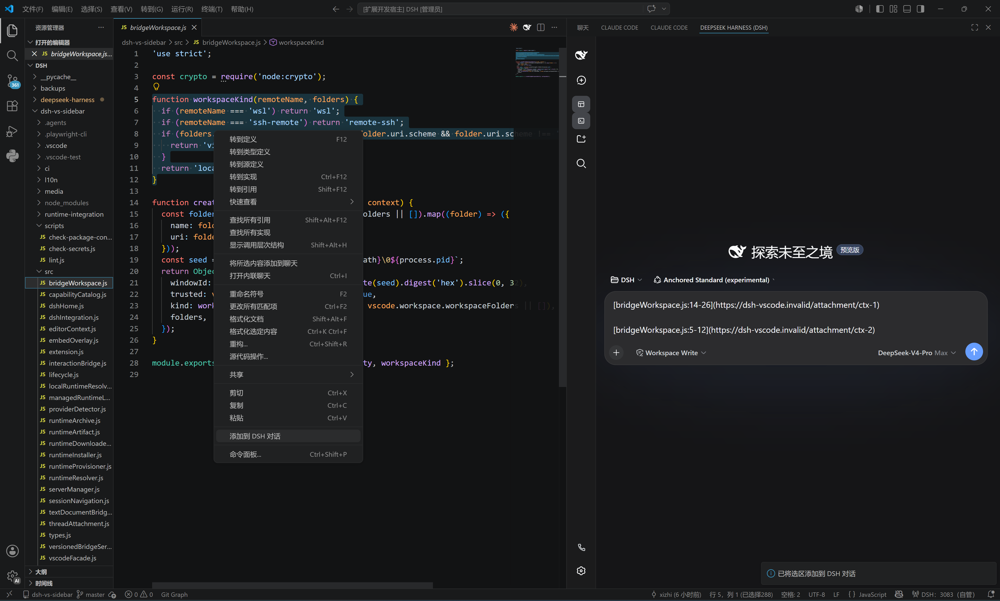

# DeepSeek Harness(dsh) for VS Code

[简体中文](README.zh-CN.md) · [English](README.md)

把本地 [DeepSeek Harness](https://github.com/deepseek-ai/deepseek-harness)（DSH）Web 界面嵌入 VS Code 辅助侧边栏（右侧栏，与 Copilot Chat 同排）。默认情况下，每个 VS Code 窗口都会以当前工作区为 cwd 单独启动并持有一个 `dsh web` 子进程，再以紧凑的全屏 iframe 渲染。

## **VS CODE 交互保证（0.9.0）**

**在扩展自管的 DSH 会话中，模型输出的“复制”**与嵌入页面内的原生 ⌘C/⌘X/⌘V（Ctrl+C/X/V）**——包括聊天输入框内的选区——均使用 VS Code 剪贴板**；嵌入页面跟随 VS Code 明暗主题而非操作系统；`Read …` 文件（包括共享旧会话中位于当前工作区之外的绝对路径）在拥有该 DSH 进程的 VS Code 窗口中打开，HTTP/HTTPS 链接在 VS Code Simple Browser 中打开。Markdown 文件不再回退到 Typora 等 Windows 默认关联程序。在编辑器正文右键，无需选中文字即可“将文件添加到 DSH 对话”，选中代码后也可“添加到 DSH 对话”；两者都只向当前 DSH 草稿追加紧凑的文件名/行号 Markdown 链接，不粘贴代码正文；消息渲染后点击链接，会在所属 VS Code 窗口重新打开并选中该附件。扩展绝不会自动发送。**

## 选区链接示例

选中一个或多个代码范围，右键选择 **添加到 DSH 对话**，DSH 草稿会收到紧凑的文件名/行号 Markdown 链接，而不是粘贴代码正文。下图演示了在同一草稿中连续附加两个选区。



## 🚨 **重要警告：隔离模式会让原有模块看起来全部“消失”**

> [!IMPORTANT]
> **默认（自 0.6.0 起）使用 `dsh.home.mode: shared`，直接采用 DSH 官方用户目录（优先 `DSH_HOME`，否则 `~/.dsh`）。独立 DSH 原有的模块、skills、providers、凭据、预设和会话会直接共享到 VS Code 侧栏。**
>
> 只有需要为本扩展单独维护一套模块配置时，才应设置 `dsh.home.mode: isolated`。隔离模式使用扩展私有的 `globalStorage/.dsh`，首次只有官方 `web` profile。切换模式后，所有模块可能看起来突然消失，但数据没有被删除，只是仍在另一套 DSH_HOME 中；扩展绝不会自动复制或合并两个目录。
>
> 首次从 0.4.x 升级时，如果旧隔离目录非空且用户尚未明确选择模式，扩展会自动保留旧隔离模式以保护模块与会话。执行 **DSH：诊断** 可查看当前实际模式和路径，确认后再显式切换为 `shared`。

`dsh.autoStart=true` 时 VS Code 自动拉起 `dsh web` 是预期行为。runtime 程序与 DSH 用户数据已经解耦：无论使用本机官方 npm 包，还是 manifest/SHA-256 校验的托管 runtime，都会使用选定的共享或隔离目录。

## 安装需求

| 项 | 要求 |
|---|---|
| VS Code | ≥ 1.106，仅桌面版 |
| DSH（默认自动启动） | `npm install -g @deepseek-ai/dsh`；扩展自动发现官方包 |
| Node.js | 可被自动发现；非标准位置可设置 `dsh.local.nodePath` |
| DSH 配置 | 无需预建；共享模式创建/复用官方 `~/.dsh`，隔离模式创建扩展私有目录 |

## 安装

- 开发调试：打开本仓库 → `F5` → **Run Extension**
- 验证：`npm ci` → `npm run check:w0` → `npm run test:extension-host`
- 密钥扫描：`npm run test:secrets` 扫描将进入 VSIX 的源码/文档（不扫 `node_modules`、`.git`、`.vscode-test`），命中硬编码桥接 token、`Authorization: Bearer` 凭据、API key、私钥或密码字面量时以 1 退出；示例/测试 fixture 使用显式 `// allow-secret-scan` 注释放行。
- 打包安装：`npm i -g @vscode/vsce && vsce package --no-dependencies` → `code --install-extension deepseek-harness-dsh-for-vscode-0.9.2.vsix`

## 使用

- `Ctrl+Alt+B` 打开辅助侧边栏 → **DeepSeek Harness (DSH)** 标签
- 可选 `Ctrl+L`（macOS 为 `Cmd+L`）：开启 `dsh.keybindings.ctrlL` 后，在编辑器中按下即可把当前选区加入 DSH 对话
- 可选 `Ctrl+I`（macOS 为 `Cmd+I`）：开启 `dsh.features.ctrl-i` 后，运行 **用 DSH 文件编辑（Ctrl+I）**，在 QuickPick 中选择 1–8 个工作区文件，多文件上下文块会发送到 DSH 对话。不贡献默认键位。
- 可选 `Ctrl+K`（macOS 为 `Cmd+K`）：开启 `dsh.features.ctrl-k` 后，选中代码并运行 **用 DSH 编辑（Ctrl+K）**，输入指令即可把「选区+指令」草稿发送到 DSH 对话。不贡献默认键位——可自行添加：
  ```json
  { "key": "ctrl+k", "command": "dsh.ctrlKEdit", "when": "editorTextFocus && editorHasSelection" }
  ```
  （macOS 请用 `"key": "cmd+k"`）
- 命令（命令面板）：**在浏览器中打开 DSH** · **新建会话** · **切换会话** · **打开会话历史** · **重启 DSH 服务** · **干净重启 DSH 服务** · **停止 DSH 服务** · **聚焦 DSH 侧边栏** · **将文件添加到 DSH 对话** · **将文件夹添加到 DSH 对话** · **添加到 DSH 对话** · **将活动文件添加到 DSH 上下文** · **将活动选区添加到 DSH 上下文** · **将 Problems 添加到 DSH 上下文** · **能力与集成** · **诊断** · **清理孤儿 DSH 服务** · **设置 DSH** · **新建 DSH 实例** · **DSH 变更** · **设置 DSH FIM API Key**
- 附加面板：运行 **DSH: 新建 DSH 实例**（或开启 `dsh.multiInstance.entry` 显示侧栏标题栏入口）在编辑器区域打开新的 DSH 面板。所有面板共享本窗口唯一的 DSH 进程；每个面板拥有独立 DSH 会话（`dsh_session`），关闭面板仅释放该会话
- `dsh.autoStart` 开启时，VS Code 启动即拉取服务，即使侧边栏从未打开
- 模型路由（L2，默认关闭）：`dsh.lm.route` 设为 `fixed` 或 `dynamic`（配合 `dsh.features.lm-route`）后，DSH 模型以 vendor `dsh` 出现在 VS Code 语言模型选择器，经桥令牌鉴权的 `/api/lm` 路由提供服务——绝不消耗 Copilot 配额
- MCP 消费（L2，默认关闭）：开启 `dsh.features.mcp-consume` 后，DSH 可经 `vscode/mcp/*` 桥方法使用 DSH profile 中配置的 VS Code 侧 MCP 服务器；每个服务器/工具调用都要过同意门（**DSH: 刷新 MCP 服务器** / **DSH: 忘记 MCP 同意**）
- 变更评审（L2，默认关闭）：开启 `dsh.features.changes-review` 后，DSH 推送的工作区编辑进入 **DSH 变更** 树，提供 diff 查看 / 接受 / 撤销，写文件前需审批
- 模型路由（L2，默认关闭）：`dsh.lm.route` 设为 `fixed` 或 `dynamic`（配合 `dsh.features.lm-route`）后，DSH 模型以 vendor `dsh` 出现在 VS Code 语言模型选择器，经桥令牌鉴权的 `/api/lm` 路由提供服务——绝不消耗 Copilot 配额
- MCP 消费（L2，默认关闭）：开启 `dsh.features.mcp-consume` 后，DSH 可经 `vscode/mcp/*` 桥方法使用 DSH profile 中配置的 VS Code 侧 MCP 服务器；每个服务器/工具调用都要过同意门（**DSH: 刷新 MCP 服务器** / **DSH: 忘记 MCP 同意**）
- 变更评审（L2，默认关闭）：开启 `dsh.features.changes-review` 后，DSH 推送的工作区编辑进入 **DSH 变更** 树，提供 diff 查看 / 接受 / 撤销，写文件前需审批

> **干净重启 DSH 服务** 会在重启前通过 `vscode-clean.overlay.yml` 禁用活动 profile 中所有非核心（非 `@deepseek-ai/*`、非 embed）插件。当启动以 `HEALTH_TIMEOUT` 或 `SPAWN_EXITED_EARLY` 失败时，状态页提供 **Restart-Clean** 入口；干净模式下会显示带 **Restart-normal** 的横幅，后者以正常 embed overlay 重启。当 `--patch` overlay 生效期间发生提前退出时，会自动不带该 patch 重试恰好一次（记录在 Diagnose 中）。

## 首次运行设置（onboarding）

首次激活时，扩展会询问 **“DSH 已就绪——现在设置吗？”**，提供三个选择：**设置**（Set up）打开多步向导，**暂时不要**（Not now）在下次激活时再次询问，**不再询问**（Never）则不再询问（直到执行该命令为止）。向导依次引导 **profile**（默认 `web`，按 `^[A-Za-z0-9._-]{1,64}$` 校验；修改后需要重载窗口生效）、**自动启动**、**关闭策略**、信息性的 **watchdog / 路线图** 步骤（多实例、Tab 补全、MCP、模型路由等 L2 可选特性作为开关列出，之后在设置中按需开启）、已实现的 **DSH 功能开关**，以及确认用的 **汇总**。每个通过的步骤都会立即（全局作用域）写入其 `dsh.*` 设置，因此跳过某一步会保留其当前值。所有文案都经 `vscode.l10n` 语言包提供双语。随时用 **设置 DSH** 命令重跑向导，之后再在设置页（`dsh.*`）逐项调整。

## 会话切换

**新建会话** / **切换会话** / **打开会话历史** 使用 DSH 本地会话 API。**切换会话** 通过 QuickPick 展示每个根会话的标题、工作区路径、更新时间与运行状态；选中后 iframe 会带上 `dsh_session` 查询参数重载，DSH Web 界面据此打开对应会话。**打开会话历史** 是在 `dsh.features.chat-participant` 门禁下的同一选择器；无服务或无会话时以警告优雅退出。扩展不维护第二份会话树——DSH 服务本身始终是会话数据的唯一来源。**新建会话** 会为当前工作区根目录创建会话；若同 cwd 下已存在 blank 会话，则优先复用而不是重复创建。

## 聊天参与者（@dsh）

开启 `dsh.features.chat-participant`（L2，默认关闭）后，扩展会向 VS Code 聊天视图贡献 **@dsh** 参与者。输入 `@dsh` 并附上你的问题：参与者会解析当前工作区的 DSH 会话，把提示词入队（`session.prompt`，mode `queue`），并把 DSH 会话的文本增量流式写回聊天回复。Follow-up 会提供最多 5 个最近的根会话，供一键继续。

**D9 边界**：参与者绝不读取 `request.model`，绝不消耗 `vscode.lm` / Copilot 配额——它只与本机回环地址上的 DSH 会话 API 通信。

## Tab 补全（FIM POC）

开启 `dsh.features.tab-completion`（L2，默认关闭）后，扩展会为 `file` 文档注册内联补全 provider，并向扩展自管的 DSH 子进程注入每窗口 `DSH_FIM_BRIDGE_TOKEN`，使 DSH 侧 vscode-fim 插件的 `/api/fim` 端点只应答本窗口。

这是 **POC 级** 功能。若达不到 D13 质量标准，将整体撤销，而不是发布半成品。

- **模型自选**：DSH 侧 vscode-fim 插件负责 `fimApi` / `fimBaseUrl` / `fimModel`；扩展侧只通过 `dsh.fim.model`（机器级）选择模型。
- **API key**：用 **设置 DSH FIM API Key** 命令写入 VS Code `secretStorage`（`dsh.fim.apiKey`），绝不进入 `dsh.*` 配置。
- **默认关闭**：功能关闭时零注册、零 spawn-env 注入。

## 编辑器上下文（显式附加）

在编辑器正文右键：无需选中文字即可选择 **将文件添加到 DSH 对话**，选中代码后可选择 **添加到 DSH 对话**。两条命令都会聚焦 DSH 侧栏，并只追加类似 `[app.js](…)` / `[app.js:5-8](…)` 的 Markdown 链接，不把代码正文粘进输入框；消息渲染后点击链接，会在所属 VS Code 窗口打开文件并选中对应范围。原有草稿会保留，消息不会自动发送。

**将文件添加到 DSH 对话** 是唯一允许附加工作区之外受信任 `file://` 文档的命令（例如通过 `文件 > 打开文件…` 打开的外部文件）。该显式用户许可只作用于命令本身及其产生的附件链接；版本化桥的 `open`、`openDiff` 与显式传入的 diagnostics 请求仍保持工作区内限制，而「将活动文件 / 选区 / Problems 添加到上下文」继续使用隐式附件的工作区门禁。

扩展不会隐式发送任何编辑器内容。活动文件、选区与 Problems 只有在你执行「将 … 添加到 DSH 上下文」命令后才进入 DSH；之后 `vscode_editor` 工具只能经版本化桥读回这些已批准的附件。

- 文件、选区与 Problems 附件只存在于窗口内存，工作区根目录变化时自动清空。
- 超过 1 MiB（UTF-8）的附件直接拒绝而不是静默截断；诊断上限为 1000 条、每条消息 2000 字符。
- 桥的 `open` / `openDiff` / 显式 diagnostics 只接受受信任且位于已打开工作区内的 `file` URI——桥不暴露任意命令、URI 或文件读取。
- 发往 DSH 的 `vscode/contextChanged` 通知只携带 revision 与 attachment id，永不携带内容。CH1 v2 新增的 `selectionChanged` / `activeEditorChanged` / `diagnosticsChanged` 同样是纯元数据通知，并在宿主边界按 `V2_NOTIFICATION_SCHEMA` 校验。

## 导出 API

开启 `dsh.features.exports` 后，扩展的 `activate()` 会返回冻结的编程式 API（`version: "1"`），包含三个方法：

| 方法 | 签名 | 说明 |
|---|---|---|
| `ask` | `ask(prompt, opts?) → Promise<{accepted: true, sessionId}>` | 把 prompt 加入当前工作区会话。`prompt` 为非空字符串且不超过 100000 字符；`opts.sessionId`（缺省使用当前工作区会话）、`opts.mode`（`"queue"` 或 `"steer"`）、`opts.signal`（AbortSignal）。 |
| `listSessions` | `listSessions(opts?) → Promise<Array<object>>` | 经会话 API 列出 DSH 会话；`opts.signal` 会被透传。 |
| `addContext` | `addContext(uri, range?) → Promise<{id, kind, uri}>` | 把一个 `file://` URI（字符串或 `vscode.Uri`）附加到当前上下文。以 `/` 结尾的 URI 走文件夹附加；`range` 形状为 `{start:{line,character}, end:{line,character}}`。 |

稳定错误码（`DshExportError.code`）：`DSH_EXPORT_DISABLED`、`DSH_EXPORT_NO_SERVER`、`DSH_EXPORT_INVALID_PROMPT`、`DSH_EXPORT_INVALID_URI`、`DSH_EXPORT_OUTSIDE_WORKSPACE`、`DSH_EXPORT_TOO_LARGE`、`DSH_EXPORT_TOO_MANY_FILES`。

v1 边界：

- **无流式**：`ask` 只返回 `{accepted: true, sessionId}`；没有 SSE/文本增量流式接口。
- **`addContext` 有界**：每次调用只能附加一个 URI；编辑器上下文预算仍然生效（超过 1 MiB 的文件直接拒绝而不是截断）。
- **L2 默认关闭**：`dsh.features.exports` 关闭时 face 依然存在（第三方可依赖稳定形状），但所有方法调用都会抛 `DSH_EXPORT_DISABLED`，直到开启该设置。
- **破坏性变更需升 major**：face 冻结为 `version: "1"`；删除方法或变更签名必须作为新的 major 版本发布。
- **第三方开启指引**：第三方在设置中把 `dsh.features.exports` 设为 `true`（机器级），然后从 `activate()` 读取返回的 face。

## 能力与诊断

**能力与集成** 会聚焦 DSH 侧边栏，并在 DSH Web 界面中打开能力中心。扩展内置一个受控的小型 provider 目录（`src/capabilityCatalog.js`）与 provider 检测器（`src/providerDetector.js`），本轮只报告四个框架候选的安装/启用状态：

- 远程开发：`ms-vscode-remote.remote-wsl`、`ms-vscode-remote.remote-ssh`
- GitHub：`GitHub.vscode-pull-request-github`
- 浏览器：`browser-provider-placeholder`（在 W5 选定并验证浏览器 provider 之前的框架占位）

扩展从不安装第三方 provider。**本轮所有第三方 provider 均为 `manual-assist`**；由于稳定接口审计（G3）尚未关闭，任何条目都不会被标记为 `integrated`。`vscode/extensions/openDetails` 只会打开目录受控的 VS Code 扩展详情页或官方 `https://` 文档页——不存在任何安装代码路径。

**诊断** 会读取 `dsh.*` 配置、服务状态、桥接状态、目录 revision 与 provider 检测结果，并显示一条摘要消息。完整诊断输出与 OutputChannel 有意留到后续 W4 切片。

## 工作区与桥接能力（0.6–0.9）

- **插件目录**（`src/catalog/*`、`src/detection/*`、`src/diagnose/*`）：经 schema 校验的 catalog 契约描述 DSH 插件分类/条目，L3 探针在选定 DSH home 内检测已安装插件，诊断结果包含插件摘要。
- **工作区注册表**（`src/context/workspaceBinding.js`、`src/ch2/workspaceClient.js`）：侧边栏通过 DSH 的 `workspace.list/create` API 绑定 VS Code 工作区根。切换活动工作区根时经注册表重绑会话——**不会 kill 或重启自管子进程**。自管服务自动创建工作区记录，复用服务会先征求同意。
- **CH1 v2**（`src/protocol/ch1.js`、`src/ch1/notifier.js`）：版本化桥协商 v1/v2 协议，新增纯元数据 `selectionChanged` / `activeEditorChanged` / `diagnosticsChanged` 通知，经 150ms 合并器发送，并按 `V2_NOTIFICATION_SCHEMA` 校验。
- **命令薄壳**（`src/commands/shell.js`、`src/commands/addFileToThread.js`）：命令先经 capability-router 门禁再执行；`dsh.addFileToThread` 是首个接入薄壳的命令。

provider 状态通过 `vscode.extensions.onDidChange` 刷新，并在版本化桥上发送 `vscode/providerStatesChanged` 通知。检测器每次调用都会重新读取 `vscode.extensions`，绝不跨工作区缓存状态。

## VS Code 桥接能力与路线图

版本化桥（`versionedBridgeServer` + CH1 协议，v1→v3 协商）是 DSH 访问 VS Code 窗口的通道。常开方法保持只读/仅打开，受工作区信任与按窗口回环 token 保护；凡是触及终端、UI 表面、编辑器缓冲或跨扩展调用的能力族都**默认关闭**，藏在显式的 `dsh.bridge.*` / `dsh.features.*` 同意开关之后。

### 已暴露给 DSH（常开）

| 类型 | 已暴露的方法 / 通知 |
|---|---|
| 编辑器读取 | `vscode/editor/getContext` |
| 打开文件 | `vscode/editor/open` |
| 打开 Diff | `vscode/editor/openDiff` |
| 诊断 | `vscode/workspace/getDiagnostics` |
| 扩展 / Provider | `vscode/extensions/getProviderStates` · `vscode/extensions/openDetails` · `vscode/extensions/list` |
| 工作区搜索 | `vscode/workspace/findFiles` |
| 通知（v1） | `vscode/contextChanged` · `vscode/providerStatesChanged` · `vscode/workspaceChanged` |
| 通知（v2） | + `vscode/editor/selectionChanged` · `vscode/editor/activeEditorChanged` · `vscode/diagnosticsChanged` |

### 同意开关之后的能力（v3，默认关闭）

| 开关 | 能力族 |
|---|---|
| `dsh.bridge.terminal` | `vscode/terminal/create` · `vscode/terminal/sendText` · `vscode/terminal/read` —— 桥建集成终端（最多 8 个并发，环形缓冲回读） |
| `dsh.bridge.ui` | `vscode/window/showMessage` · `vscode/confirm/ask` · `vscode/progress/*` · `vscode/statusbar/update` · `vscode/output/append` —— 用户可见的 VS Code 表面 |
| `dsh.bridge.editorRead` | `vscode/editor/getState` · `vscode/editor/read` —— 读取活动编辑器未保存缓冲 |
| `dsh.features.changes-review` | `vscode/changes/push` —— DSH 提议的工作区编辑进入 **DSH 变更** 树评审（diff / 接受 / 撤销，需审批） |
| `dsh.features.mcp-consume` | `vscode/mcp/listServers` · `vscode/mcp/listTools` · `vscode/mcp/callTool` —— 过同意门的 MCP 工具调用 |
| `dsh.features.call-export` | `vscode/extensions/callExport` —— 经同意门调用其他扩展的 exports 面，带调用日志 |
| 任务与调试 | `vscode/tasks/list` · `vscode/tasks/run` · `vscode/debug/start` · `vscode/debug/stop` · `vscode/debug/getStack` —— launch.json 调试会话与 `tasks.json` 执行 |
| Git 读取 | `vscode/git/getStatus` · `vscode/git/getDiff` —— 经内置 Git 扩展 API 的只读状态 |

### 尚未暴露

- 文件编辑：`applyEdits` / 直接修改工作区文件
- 调试断点 / 单步控制（会话与调用栈回读已可用）
- Git 写操作：暂存、提交、应用 diff

### 实现 Cursor / Claude Code 式体验的路线图

v3 桥已覆盖原路线图的大半——终端、任务、调试 启动/停止/调用栈、Git 状态/diff 回读、工作区搜索、确认/进度/状态栏/输出 UI 表面，以及带审批的变更评审层。剩余部分：

1. **写侧编辑器方法** —— `vscode/editor/applyEdit` 与直接工作区文件修改，带逐编辑审批与回滚。
2. **调试深度** —— 断点与单步控制（会话与调用栈回读已可用）。
3. **Git 写操作** —— 暂存 / 提交 / 应用 diff，每步显式确认。
4. **Agent-loop 体验打磨** —— 终端输出流入对话、诊断/测试反馈闭环、编辑器内建议的接受/拒绝 UI。

**当前状态：** 常开表面保持只读/仅打开；凡可执行或可变更的能力都藏在显式同意开关之后（见上表）。

## 配置

| 键 | 默认 | 说明 |
|---|---|---|
| `dsh.port` | 3080 | 探测/启动 DSH Web 服务的端口 |
| `dsh.host` | 127.0.0.1 | 当前 DSH Web profile 要求使用的固定回环地址 |
| `dsh.autoStart` | true | VS Code 启动时以选定目录和 `web` profile 拉起官方 DSH；runtime 解析失败时可复用配置端点（false = 仅复用） |
| `dsh.home.mode` | `shared` | `shared` 使用官方 DSH_HOME；`isolated` 使用扩展私有 `globalStorage/.dsh`，单独维护模块配置 |
| `dsh.home.path` | （空） | shared 模式下的机器级绝对路径覆盖；留空依次使用 `DSH_HOME`、`~/.dsh` |
| `dsh.profile` | `web` | 窗口级 DSH profile 目录，位于所选 home 之下；必须匹配 `^[A-Za-z0-9._-]{1,64}$` |
| `dsh.closePolicy` | `onVscodeExit` | 何时停止扩展自己拉起的服务（见下表） |
| `dsh.local.packageRoot` | （空） | 机器级可选的官方 `@deepseek-ai/dsh` 包根目录绝对路径；留空时自动探测 npm 全局安装 |
| `dsh.local.nodePath` | （空） | 机器级可选的 Node.js 可执行文件绝对路径；留空时自动探测 |
| `dsh.runtime.manifestUrl` | （空） | 机器级可选的 HTTPS 运行时发布清单；留空使用本机官方 npm DSH，非空时改用带 manifest/SHA-256 校验的托管 runtime 安装 |
| `dsh.runtime.version` | （空） | 托管 runtime 的可选版本锁定；仅在配置 manifest URL 时生效 |
| `dsh.features.clipboard-bridge` | true | DSH iframe 与 VS Code 剪贴板之间的内嵌复制/粘贴桥（L1 功能；关闭后 DSH 复制按钮写入 webview 剪贴板） |
| `dsh.features.thread-attachment` | true | 把活动文件/选区/Problems 添加到 DSH 对话（L1 功能；关闭后不再注册「添加到 DSH 对话」命令） |
| `dsh.features.editor-links` | true | 在本 VS Code 窗口中打开 DSH 的 `Read …` 与草稿附件链接（L1 功能；关闭后不启动文本文档桥） |
| `dsh.features.statusbar-basic` | true | 状态栏中的基础 DSH 状态指示（L1 功能；关闭后失败时仍会以 L0 `$(error)` 兜底呈现） |
| `dsh.features.theme-follow` | true | 内嵌 DSH iframe 跟随 VS Code 当前颜色主题（深色/浅色）（L1 功能；关闭后不附加 `dsh_theme` URL 参数、不监听主题变化） |
| `dsh.features.changes-review` | false | 审查 DSH 提议的工作区编辑：审批弹窗、`dsh.changes` 树视图与 `vscode/changes/push` 桥接处理器（L2 功能） |
| `dsh.features.ctrl-k` | false | 启用「用 DSH 编辑（Ctrl+K）」命令；不贡献默认键位（L2 功能） |
| `dsh.features.ctrl-i` | false | 启用「用 DSH 文件编辑（Ctrl+I）」命令：选择 1–8 个工作区文件并以多文件上下文块发送到 DSH 对话（L2 功能） |
| `dsh.features.lm-route` | false | 在 VS Code 语言模型聊天选择器中以 vendor `dsh` 暴露 DSH 模型（L2 功能） |
| `dsh.lm.route` | `off` | DSH 模型路由模式：`off` = 从不注册 dsh 聊天 provider；`fixed` = 拉取一次 `/api/lm/models` 并缓存；`dynamic` = 每次打开选择器时刷新模型列表 |
| `dsh.features.mcp-consume` | false | 允许 DSH 经桥使用 VS Code MCP 服务器（`vscode/mcp/listServers`/`listTools`/`callTool`）（L2 功能） |
| `dsh.features.exports` | false | 启用扩展 `activate()` 返回的编程式导出 API（`ask`/`listSessions`/`addContext`）（L2 功能；关闭时调用抛 `DSH_EXPORT_DISABLED`） |
| `dsh.features.call-export` | false | 允许 DSH 经同意门调用其他扩展的 exports 面（`vscode/extensions/callExport`），带调用日志（L2 功能，机器作用域） |
| `dsh.features.chat-participant` | false | 在 VS Code 聊天视图中启用 **@dsh** 聊天参与者；只消费 DSH 会话，绝不使用 `vscode.lm`/Copilot 配额（L2 功能） |
| `dsh.features.tab-completion` | false | 为 `file` 文档启用 DSH FIM Tab 补全 provider（L2 功能；POC 级） |
| `dsh.fim.model` | （空） | 机器级：Tab 补全使用的 DSH 侧 FIM 模型名；上游 API key 与 base URL 在 DSH 侧 vscode-fim 插件中配置 |
| `dsh.keybindings.ctrlL` | false | 启用 Ctrl+L（macOS 为 Cmd+L）键位：将当前编辑器选区加入 DSH 对话（默认关闭） |
| `dsh.multiInstance.entry` | false | 在 DSH 侧栏标题栏显示「新建实例」入口（默认关闭） |
| `dsh.bridge.terminal` | false | 允许 DSH 经运行时桥使用 VS Code 终端（create/send/read，上限 8 个） |
| `dsh.bridge.editorRead` | false | 允许 DSH 经桥读取活动编辑器的未保存缓冲 |
| `dsh.bridge.ui` | false | 允许 DSH 经桥展示 VS Code 用户可见界面（窗口消息、进度通知、状态栏、输出通道、confirm/ask 询问） |

`dsh.closePolicy` 取值：

| 值 | 行为 |
|---|---|
| `onVscodeExit` | 仅在 VS Code 退出时停止自管服务（默认） |
| `onViewClose` | 关闭侧边栏视图时也停止自管服务 |
| `never` | 永不自动停止——请使用「停止 DSH 服务」命令；窗口崩溃后的存活进程由「清理孤儿 DSH 服务」列出 |

任何策略或命令都不会停止被复用的（非自管）实例。

## 兼容性

- VS Code ≥ 1.106（`secondarySidebar`）；显式 `activationEvents`；`extensionKind: [workspace]`
- Windows / macOS / Linux
- 每个扩展自管 DSH 子进程都会收到经鉴权的回环桥接 URL/token；支持此约定的 DSH 版本会把配置路径 POST 回所属扩展宿主，再由 `vscode.window.showTextDocument` 在该扇窗口内打开。`DSH_TEXT_EDITOR=vscode` 仅保留为旧版 DSH 的 CLI 回退；被复用的外部服务仍遵循自身编辑器策略
- iframe 会收到 `dsh_embed=vscode`；支持此约定的 DSH 版本会隐藏内部侧边栏、详情栏和拖动手柄，而「在浏览器中打开」仍保持普通完整布局
- 自管子进程会收到位于 `DSH_HOME/.integrations/vscode-sidebar/vscode-embed.overlay.yml` 的动态 `--patch` overlay，用于禁用会重复嵌入界面的插件（`better-sidebar`、`ui-dsh-aionui-panel`），且不修改 DSH 源码、profile 或用户的 `cordis.patch.yml`
- 默认 autoStart 只接受身份为 `@deepseek-ai/dsh` 的本机 npm 包，并解析真实 package/entrypoint/Node 绝对路径；不会执行 PATH 中身份不明的 `dsh` shim。显式配置 manifest URL 时，托管 runtime 仍执行指针、manifest 与 payload SHA-256 校验。两条路径失败都会先尝试复用配置端点已有的 DSH，再在状态页显示错误
- 进程清理：`taskkill /T /F` 树杀（Windows——强制终止，非优雅停止）；detached 启动 + `kill(-pid)` 进程组 SIGTERM（POSIX）
- 不受信任 / 虚拟工作区**不支持**（会启动本地进程并操作工作区文件）——已通过 `capabilities` 声明
- 容器/视图 ID `dsh-sidebar` / `dsh.webview` 是**持久化契约**——发布版不可变更（否则用户侧边栏布局重置）
- 界面语言随 VS Code 切换（中/英）：manifest 走 `package.nls.*.json`，运行期文案走 `vscode.l10n`（`l10n/bundle.l10n.*.json`）
- 发布验证改为本地执行：`npm run check:w0` 与 `npm run test:extension-host`；仓库有意不再维护 GitHub Actions workflow。

## 安全与信任模型

扩展维护**两条信任边界不同的桥**，这是有意设计：

- **版本化 CH1 桥**（`src/versionedBridgeServer.js`，经每窗口随机 token 鉴权，注入 `DSH_VSCODE_BRIDGE_*` 环境变量）：`open`、`openDiff` 与显式传入的 diagnostics **只接受已打开、受信任工作区内的 `file://` URI**，外加用户显式批准的附件。这是面向模型（`vscode_editor`）的能力面。
- **文本文档桥**（`src/textDocumentBridge.js`，独立每进程 token，注入 `DSH_VSCODE_OPEN_TOKEN`）：在通过工作区信任检查后，**有意允许打开任意绝对本地路径**到所属 VS Code 窗口，以兼容共享旧会话中位于当前工作区之外的 `Read …` 文件链接。token 只注入本扩展自管的 DSH 子进程，但 DSH 是 agent harness：子进程里的模型决定打开什么，等价于用户本人打开。它只是“在编辑器中打开”路径——不会把文件内容读回 DSH、也不能执行命令——但仍可能抢占窗口焦点（`showTextDocument(preserveFocus: false)`）。
- **`dsh.addFileToThread`** 是中间地带：显式用户命令可附加工作区外受信任的 `file://` 文档；产生的附件链接只能经已批准附件路径重新打开。

如果你使用共享 home 的 DSH 会话、且模型不完全可信，请保持工作区信任开启，并把内嵌 DSH 视为具备“在编辑器中打开文件”能力的 agent，而不是沙箱 webview。

## 启动错误码

启动失败在 `src/startupErrors.js` 中集中分类。每个错误码带有 `retryable`、本地化的 `template` 与 `diagnoseHint`；`dsh.diagnose` 会打印完整的错误码表。未知错误码回退显示原始错误文本。

| 错误码 | 可重试 | 模板 |
|---|---|---|
| `AUTOSTART_DISABLED` | 否 | `DSH is not running and dsh.autoStart is disabled` |
| `CONFIG_HOST_UNSUPPORTED` | 否 | `Unsupported dsh.host "{host}"; this extension requires {expected}` |
| `CONFIG_PORT_INVALID` | 否 | `Invalid dsh.port "{port}"; expected an integer from 1 to 65535` |
| `CONFIG_PACKAGE_ROOT_INVALID` | 否 | `Invalid dsh.local.packageRoot: {path}` |
| `CONFIG_NODE_PATH_INVALID` | 否 | `Invalid dsh.local.nodePath: {path}` |
| `CONFIG_HOME_PATH_INVALID` | 否 | `Invalid DSH home path: {path}` |
| `CONFIG_PROFILE_INVALID` | 否 | `Invalid dsh.profile: {profile}` |
| `RUNTIME_NOT_INSTALLED` | 是 | `Official DSH is not installed. …` |
| `RUNTIME_NODE_MISSING` | 是 | `Node.js was not found …` |
| `NO_FREE_PORT` | 是 | `No free port found within {limit} ports starting from {start}` |
| `SPAWN_ERROR` | 是 | `Failed to start dsh: {error}` |
| `SPAWN_EXITED_EARLY` | 是 | `DSH process exited early (code={code}, signal={signal})` |
| `HEALTH_TIMEOUT` | 是 | `DSH service did not become ready within {seconds}s; process terminated (pid={pid})` |
| `BRIDGE_INIT_TIMEOUT` | 是 | `VS Code bridge initialization timed out` |

针对 `HEALTH_TIMEOUT` / `SPAWN_EXITED_EARLY` 的干净重启处理属于 B 批次，未在 A 批次中实现。

## 已知限制

- **真实 browser provider 尚未接入**：能力目录当前仅列出 `browser-provider-placeholder`，provider 选定与验证留待 W5。
- **Extension Host smoke 版本**：smoke 测试默认运行在 VS Code 1.106 上。
- **Spawn 输出写入每次启动截断的日志文件，而非 OutputChannel**：实例注册表可写时，DSH 子进程 stdout/stderr 被捕获到 `<globalStorage>/dsh-server-<port>-<pid>.log`（每次 spawn 截断）；意外崩溃在状态页仍主要显示 exit code。VS Code OutputChannel 视图是后续硬化项。
- **崩溃残留需要一步手动清理**：VS Code 崩溃或 `closePolicy: never` 后，存活的 owned DSH 有意不被自动 kill（可能仍在被使用）。执行 **清理孤儿 DSH 服务** 可列出 pid 仍存活的注册表条目；命令会逐项探测端点，只终止仍以 DSH 身份应答的进程，否则仅提供“移除记录”。
- **启动失败已集中分类**：启动错误码集中在 `src/startupErrors.js`，带有 `retryable` / `template` / `diagnoseHint`；Retry 按钮在纯配置类失败时隐藏，runtime / 启动 / 健康类失败仍可用。干净重启（`Restart-Clean`）是单独的 B 批次项。
- **部分 DSH 复制按钮仍可能失败**：桥只替换 `navigator.clipboard.writeText`；DSH UI 若走 `document.execCommand('copy')` 兜底，会写入 webview 剪贴板而不是 VS Code 剪贴板，该项属于 DSH UI 侧。模型输出经标准 clipboard API 的复制正常工作。

## 实现原理

仓库结构：`src/`（扩展宿主）、`runtime-integration/dsh-vscode-integration/`（扩展每次激活时同步进 DSH home 的双半插件之 DSH 侧）、`test/`（单元与扩展宿主测试）、`scripts/`（lint / 打包 / 秘密扫描门禁）、`media/`、`l10n/`。内部实现笔记、QA 记录与批次计划位于 `docs/dev/`，绝不进入发布 VSIX；面向用户的问题历史见 [KNOWN_ISSUES.md](KNOWN_ISSUES.md) 与 [CHANGELOG.md](CHANGELOG.md)。

| 文件 | 职责 |
|---|---|
| `src/extension.js` | 扩展宿主组装与 DSH 连接协调 |
| `src/editorContext.js` | 显式编辑器附件、打开/打开 Diff、诊断与工作区 URI 门禁 |
| `src/threadAttachment.js` | 将编辑器选区追加到当前 DSH 草稿的带确认 Webview 桥 |
| `src/capabilityCatalog.js` | 受控 W4 provider 目录、URI 白名单、目录 revision |
| `src/providerDetector.js` | provider 安装/启用/健康检测、桥接 handler、诊断快照 |
| `src/versionedBridgeServer.js` | 版本化回环桥（编辑器、诊断、扩展） |
| `src/textDocumentBridge.js` | 每窗口 token 回环桥，用于打开 DSH 拥有的文本文件 |
| `src/bridgeWorkspace.js` | 桥接工作区身份与信任分类 |
| `src/embedOverlay.js` | 为自管 DSH 子进程动态生成 `--patch` overlay |
| `src/dshHome.js` | 共享/隔离目录解析、0.4.x 升级保护、runtime 与 home 绑定 |
| `src/lifecycle.js` | 生命周期串行队列与停用门禁 |
| `src/localRuntimeResolver.js` | 自动发现并验证本机官方 npm DSH，准备选定的 DSH home |
| `src/managedRuntimeLaunch.js` | 已验证托管运行时启动规格、profile/路径归一化、`--patch` 透传 |
| `src/runtimeResolver.js` | 托管运行时解析与 current/last-good 指针校验 |
| `src/runtimeProvisioner.js` | 发布清单解析、artifact 选择、解析或安装编排 |
| `src/runtimeArtifact.js` | 运行时 manifest 校验、SHA-256 校验、运行时目录校验 |
| `src/runtimeArchive.js` | 托管运行时的 tar.gz 安全解包 |
| `src/runtimeDownloader.js` | HTTPS 运行时下载（带重定向上限与 SHA-256 校验） |
| `src/runtimeInstaller.js` | current/last-good 运行时安装、指针切换、原子写入 |
| `src/serverManager.js` | 探测 / 复用 / 启动 / 注册表 / 清理 |
| `src/sessionNavigation.js` | DSH 会话列表/创建 API 客户端与 QuickPick 映射 |
| `src/vscodeFacade.js` | 可注入的 VS Code API 表面 |
| `src/webviewHtml.js` | iframe 页与状态页 |
| `src/webviewMessages.js` | 固定 Webview 消息路由 |
| `src/protocol/webview.js` | Webview 桥常量/校验器（外壳、宿主、客户端共享 request-id 规则） |
| `src/protocol/ch1.js` | CH1 v1/v2 方法/通知契约与 `V2_NOTIFICATION_SCHEMA` 运行时校验 |
| `src/ch1/notifier.js` | 元数据通知合并器（含 v2 schema 校验） |
| `src/ch2/workspaceClient.js` | DSH 工作区注册表 API 客户端 |
| `src/context/workspaceBinding.js` | 工作区注册表绑定状态机 |
| `src/commands/shell.js` | capability-router 命令薄壳 |
| `src/commands/addFileToThread.js` | `dsh.addFileToThread` 命令体 |
| `src/catalog/catalogSchema.js` | 插件目录 schema 校验 |
| `src/catalog/pluginCatalog.js` | 已安装插件目录快照 |
| `src/detection/pluginDetector.js` | L3 已安装插件探针 |
| `src/detection/profileProbe.js` | DSH profile/入口探测 |
| `src/detection/probeTypes.js` | 探针结果/状态契约 |
| `src/diagnose/pluginSummary.js` | 诊断用插件摘要 |
| `src/adapters/contract.js` | capability 适配器契约 |
| `src/workspaceContext.js` | 设置、工作区根与注册表路径 |
| `src/types.js` | 契约常量（端口、BOOT 标记、视图 ID） |

关键行为：

- 探测 `GET /` 响应中的 `__DSH_BOOT__` 标记（3s 超时、3 次重试——DSH 忙时不会误判为不存在而重复拉起）
- 每次 autoStart spawn 前，`connectNow` 先独立解析共享/隔离目录，再定位并验证本机官方 `@deepseek-ai/dsh`，以 `--profile web` 启动；只有显式配置 `dsh.runtime.manifestUrl` 时才走带 SHA-256 校验的托管 runtime，且同样绑定到所选目录
- 默认 `autoStart` 模式不接管其他窗口的进程：端口被占用时最多顺延扫描 50 个端口，每个扩展宿主持有自己的子进程；只有本机 DSH 解析失败时才尝试复用配置端点已有的实例
- cwd = 当前工作区（多根取活动编辑器所在目录；无工作区则继承父进程目录，不回退用户主目录）
- 远程（WSL / Remote-SSH）：`vscode.env.asExternalUri` 端口转发
- 浏览器命令与 iframe 使用同一个 externalized URL，远程会话和连接失败页同样适用
- 仅 iframe URL 增加 `dsh_embed=vscode` 紧凑布局标记；浏览器 URL 不作修改
- 工作区切换：经工作区注册表重绑 DSH 会话，不 kill、不重启自管子进程（PID 保持不变）；侧栏 iframe 以新 `dsh_session` 参数重载，DSH 端消费方等待会话列表就绪后经 `sessions.open()` 自动切到新工作区的会话
- `onStartupFinished` 激活：`dsh.autoStart` 开启时 VS Code 启动即拉取服务（未打开 webview 时同样安全）
- 默认 `onVscodeExit` 策略下，扩展停用会取消待启动操作、等待串行生命周期队列结算，并树杀期间可能刚出现的子进程；关闭一个 VS Code 窗口不会影响另一个窗口的子进程
- 生命周期流转（连接 / 停止 / 工作区重绑 / 配置协调）统一走一条串行队列，连接期间到来的视图销毁不会误杀刚重绑拉起的进程
- `dsh.stopServer` 与关闭策略**只停自管进程**；被复用的外部实例永不终止
- 注册表清理只过滤死亡条目、不会杀死存活进程；`onVscodeExit` 会在扩展宿主关闭时停止自管子进程，而 `never` 会让它继续运行，直至用户显式停止
- 编辑器桥请求拒绝非 `file` URI、`workspace.getWorkspaceFolder` 之外 URI 与不受信任工作区；远程 URI 从不被转换成本地路径

## 常见问题

- **DSH 设置里「DeepSeek 官方 API」的密钥是只读的？**
  这是 DSH 的设计：启动环境提供的 `DEEPSEEK_API_KEY` 被视为只读（否则写入会被环境变量静默覆盖）。修复：在启动 dsh web（或 VS Code）的终端里 unset 该变量后重启——`~/.dsh/.credentials.yaml` 中已存的密钥会接管，设置项即可编辑。

## 疑难排查

### 全局已装 DSH 却提示 “Official DSH is not installed”（2026-08-17）

现象：侧边栏提示 `Official DSH is not installed …`（状态页显示 `http://127.0.0.1:3080`），而 `npm ls -g` 能列出 `@deepseek-ai/dsh`。

原因：Settings Sync 把 Mac 上的机器相关值同步到了 Windows 用户设置：

```json
"dsh.local.packageRoot": "/Users/zhengduojie/.nvm/versions/node/v24.18.1/lib/node_modules/@deepseek-ai/dsh",
"dsh.local.nodePath": "/Users/zhengduojie/.nvm/versions/node/v24.18.1/bin/node",
```

在 win32 上这些 POSIX 路径能通过 `path.isAbsolute`（drive-relative），解析器因此把配置根视为权威，只搜索它、找不到，最终落到通用安装提示；自动探测（`%APPDATA%\npm\node_modules\@deepseek-ai\dsh`）从未被咨询。当前构建会在盘符校验阶段直接拒绝这类 win32 值，并把这三个路径设置保持为机器级作用域，Settings Sync 不再跨设备搬运它们。

修复：在受影响机器上删除用户设置中的 `dsh.local.packageRoot` 与 `dsh.local.nodePath`（或改成该机器正确的值），然后重载窗口。自动探测会重新从 PATH 找到已安装的包与 Node。

计划中的加固（记录于此，尚未实现）：

- **干净重启（Restart-Clean）**：A 批次启动分类已完成；针对 `HEALTH_TIMEOUT` / `SPAWN_EXITED_EARLY` 的干净 overlay 重启流程仍在规划中。

## License

MIT © Xizhi1024
