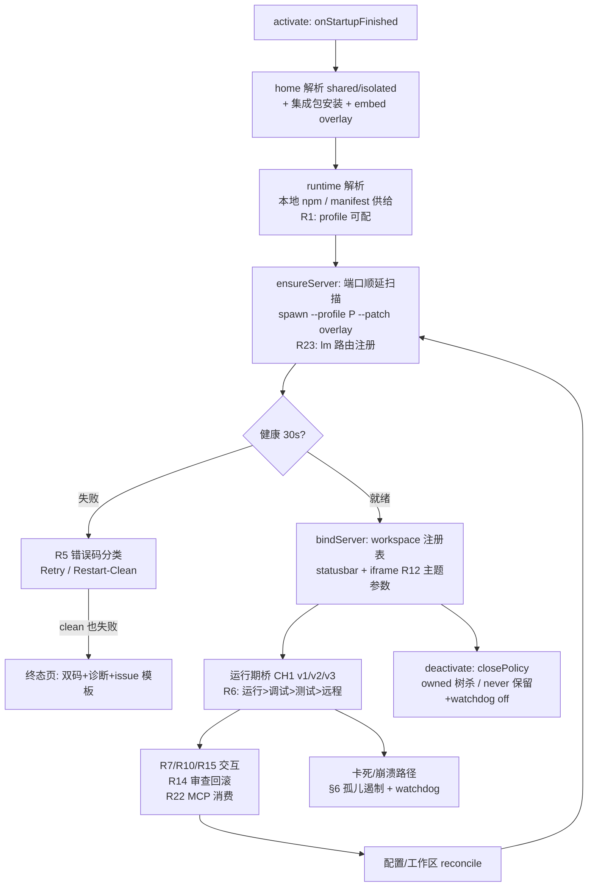

# dsh-vs-sidebar × DSH 全生命周期实现计划 v2（合并稿，供审计裁决）

> 本文件是唯一权威版本，合并并取代此前增量草稿。
> 基线：扩展仓 master `4d54c46`（0.6.0 + 0.6.1 修复 + 0.7 规划语料，均已推送）；DSH 上游最新 `v0.1.0-rc.7`（`99f6f02`）。
> 版本核对（2026-08-17，A 批开工前）：rc.5→rc.7 无扩展契约面变更——spawn `--profile`/`--patch`、embed URL 参数（dsh_embed/dsh_session 先例在 `packages/client/web` app-shell）、`boot-theme.ts`、`packages/fs`、`test:gui`/`test:web` 门禁均在；**计划无需修订**。B/D/E 批 DSH 侧任务开工前先把本地 checkout 快进到 rc.7，并遵循其 AGENTS.md 全部门禁。
> 状态：**全部决策已闭环（§12 终裁表，2026-08 用户终裁）**；P0 已完成，A 批开工。
> 执行方式：多 agent 编排（主模型只计划/集成，子 agent 分支实现+独立审计），完整规程见 `planning/0.7/EXECUTION_PROMPT.md`。

## 1. 目标与非目标

**目标**：在「启动→运行→变更→回收」全生命周期上，补齐 0.6.0 审计确认的缺口，并把 dsh-vs-sidebar 建成 DSH 在 VS Code 内的完整宿主：多 profile、可诊断可自愈的启动、干净重启、运行/调试/测试/远程 API 桥、Cursor 式交互、模型路由、exports/MCP 双向互通、Diff 审查回滚。

**非目标（已裁决/已定）**：
- 不支持 VS Code < 1.106，不做 fork（Cursor/Windsurf 等）适配与低版本 shim（D11✅）；
- DSH 不消费 Copilot / `vscode.lm` 模型配额（D9✅；R23 是反方向供给，不冲突）；
- 不读扩展私有内部实现（机制上不可达，非政策选择）；
- 不做 CodeAction/Hover/Definition 语言面（与 DSH lsp 能力重复）、不直接接 TestItem API（tasks+diagnostics 闭环已覆盖跑测试）；
- Tab 补全为 POC 制（不达标整体撤销，D13）。

**已达标不重做（每批回归锁定，§11）**：#3 窗口独占进程、#4 启动自动发现、#8 0.6.0 四修复、#9 多窗口多实例、#11 工作区即 cwd、#13 链接本窗口打开。

**全局行为约束（终裁合入）**：
- **安装后 onboarding**：首次激活以向导询问（全部可跳过、事后可改）：profile、自动启动、干净模式、closePolicy、watchdog、多开、键位、Tab 补全、MCP、R23 路由。选择落 dsh.* 设置并记录 globalState（不再重复问）。
- **修改行为询问清单**：凡改变用户 VS Code 行为的功能（键位、状态栏 item、模型选择器条目、终端使用、命令执行、callExport、Tab 补全、R23），启用前必须明确询问，**不得静默打开**；每项提供设置项可回收。
- **R14 审查边界**：文件写审查仅覆盖 VS Code 扩展注入/托管的 DSH 实例；standalone DSH（用户自行启动）不拦截、不承诺审查。
- **组件化与故障隔离（R25，§5）**：每个功能组件经统一 featureRegistry 注册，`dsh.features.<id>` 配置表可开关；非核心组件失败只降级自身；**核心组件全部失败也绝不影响 DSH 界面映射进 VS Code（L0 生命线）**——保住 iframe 侧栏即保住「至少有个 AI 能修错误」，同时向用户明示哪个组件失败。
- **默认关闭与核心豁免**：修改 VS Code 用户可见行为的功能默认全关，等用户决断；核心豁免（默认开）仅三个：**复制粘贴桥、添加对话（Add to Thread）、侧栏映射本身**。纯 DSH 侧治理（watchdog/孤儿清扫/错误分类）不改 VS Code 行为，不属此列。安装后首次激活在 VS Code 编辑器内弹出提示引导 onboarding，并告知如何修改。
- **错误直显原则**：任何错误提示直接显示真实错误（错误码+来源+上下文），不做猜测性归因、不掩饰、不显示误导性消息；降级发生时明说「某功能已降级及原因」。

## 2. 生命周期总图

## 3. 全行为预案矩阵（失败 → 降级链 → 用户可见）

原则：任何单点失败不停在无信息空白；降级链末级 = Diagnose + OutputChannel「DSH」（提前落地，不再等 W4）；一切用户可见的错误消息遵循 §1 错误直显原则（真实错误码+来源，无猜测性归因）。

| 行为 | 失败情形 | 预案（按序降级） | 用户可见 |
|---|---|---|---|
| activate 早期异常 | 任意 | try/catch 隔离；不注册 UI | 状态栏 $(error) + Diagnose |
| home/overlay 写入 | 只读/权限 | 无 --patch 启动；Diagnose 记录 | 状态页警告（DSH 自带侧栏重复属预期降级） |
| 集成包安装失败 | VSIX 资产缺失 | 照常启动，无桥增强 | 警告「Read… 链接不可用」 |
| DSH 未安装 | resolver 未命中 | ① adoptRunningDsh 复用 ② RUNTIME_NOT_INSTALLED 页：复制安装命令 +「安装并重试」（同意门） | 状态页 |
| Node 缺失 | 无 node | RUNTIME_NODE_MISSING；提示 dsh.local.nodePath | 状态页 |
| 端口耗尽 | 50 顺延全占 | NO_FREE_PORT；Diagnose 列占用者 | 建议改 dsh.port |
| spawn 失败 | EACCES 等 | SPAWN_ERROR（retryable） | Retry |
| 早期退出 | 老 DSH 不认 --patch | **自愈**：去 patch 参数重试一次 | 透明 + Diagnose 记录 |
| 健康超时 | 30s 不就绪 | 杀进程 + HEALTH_TIMEOUT + Restart-Clean 入口 | 状态页按钮 |
| **web+clean 双失败** | 干净模式也不行 | **终态页**：双错误码并列、复制诊断（dsh/node/vscode 版本、平台、home、overlay、OutputChannel 尾 50 行）、Troubleshooting 链接、issue 模板；Retry 保留 60s 节流 | 终态页 |
| 状态页不可用 | view 未解析/disposed | 状态栏 → Diagnose → OutputChannel 三级 | 降级链 |
| 桥握手失败 | 老客户端 | 2s 后 v1 直通 | 状态栏一次性提示 |
| 运行中桥死 | ext host 重启 | 工具报「桥不可用」；DSH 独立功能不受影响 | DSH 内消息 |
| 主题/剪贴板/链接 | 老 DSH 无支持 | 参数被忽略即静默降级 | 多数静默 |
| applyEdit 被拒 | 用户拒绝 | 工具返回 not-approved（模型可见） | 对话内反馈 |
| 工作区重绑失败 | registry API 异常 | 状态页 Retry；DSH 继续旧绑定 | 状态页 |

## 4. 版本偏移策略（VSIX × 用户 DSH home 独立演进）

- 单一事实源：resolver 已返回 dshVersion → `src/dshCompat.js` 推导 featureFlags（patchOverlay/themeParam/toolsV3）；集成包再做运行时自检。
- **原则：能协商的不猜版本**——桥 initialize.methods、postMessage 握手、URL 参数被忽略均走协商；版本门只用于会崩的 --patch（自愈去参重试）。
- 旧 DSH × 新 VSIX：--patch 自愈；dsh_theme 被忽略退回系统主题；v3 方法不在 methods → tools 零注册。
- 新 DSH × 旧 VSIX：未知方法被 VSCODE_METHOD_NOT_ALLOWED 拒（已有）；新 env 被忽略；无 client.js 时 DSH 完整可用仅缺增强。
- 同机漂移：集成包 activate 原子覆盖，运行中 child 重启后一致；Diagnose 显示 integration 版本 vs VSIX 版本。

## 5. R 编号工作项（含文件级落点）

### R1 profile 可配启动（A/0.7.0）
新配置 `dsh.profile`（默认 web，校验 `^[A-Za-z0-9._-]{1,64}$`，window 作用域→多窗口各用不同 profile）。解耦五处：`managedRuntimeLaunch.js`（常量→参数，校验同强度）、`dshHome.bindRuntimeHome`、`dshIntegration.js` 安装路径、`workspaceContext.config`、`extension.js` 配置监听。DSH 侧零改动。**注意**：dshIntegration 路径不同步则 openPath 桥整体失效（0.6.0 已知耦合）。

### R2 版本常量（A/0.7.0）
系统侧：补 Volta/fnm-windows/nvm-windows 候选；win32 盘符校验 `/^[A-Za-z]:[\\/]/`；三个路径 setting 转 machine scope。VS Code 侧：`src/vscodeCapabilities.js` 由 `vscode.version` 推导能力集，消费点仅 hostVersion/Diagnose/API 弃用预警（不用于降级开门，D11✅）。

### R5 错误分类 + 干净重启（A+B/0.7.0）
`src/startupErrors.js` 集中定义全部启动错误码 `{retryable, template, diagnoseHint}`（CONFIG_* 既留 + RUNTIME_*/SPAWN_*/HEALTH_TIMEOUT/BRIDGE_INIT_TIMEOUT），消灭 free-text。干净重启：`renderCleanOverlay` 枚举 profile 内第三方插件全 disabled + 叠加 embed 行，写入 vscode-clean.overlay.yml；入口 = Restart-Clean 命令 + HEALTH_TIMEOUT/SPAWN_EXITED_EARLY 状态页按钮；clean 模式状态页横幅 + Restart-normal；registry 条目 clean:true。机制选型见 D1。

### R6 CH1 v3a 桥（D/0.8.0，优先级已裁决）
**优先级：运行 > 调试 > 测试 > 远程链路验证**。方法集：terminal/create|sendText|read（同意门+≤8 终端+8KB 环形缓冲）、tasks/list|run（仅 tasks.json 声明）、debug/start|stop|getStack（仅 launch.json 配置）、workspace/findFiles（工作区内+500 上限）、window/showMessage、extensions/list（含 exportsFace 摘要）、extensions/callExport（§9 T2）、git/getStatus|getDiff（只读，best-effort）、mcp/listServers|listTools|callTool（§8）。远程验证：WSL/Remote-SSH 下 ext host 与 child 同侧、桥回环、asExternalUri 三点入 extension-host smoke 必测。

**v3a 上下文/UI 扩充（用户 API 对照表合入，含安全门）**：

| 桥方法 | VS Code API | 安全门/边界 |
|---|---|---|
| `editor/getState` | activeTextEditor/selection/textDocuments | 元数据 only（uri/语言/dirty/选区范围），无内容——免门 |
| `editor/read` `textDocument/getText` | document.getText()（**含未保存缓冲**） | **会话级同意门 + 默认 off**（`dsh.bridge.editorRead`）：0.6.0 原则「绝不隐式发送编辑器内容」保持——用户显式开启后 DSH 才能读活动编辑器/指定文档的当前缓冲 |
| `workspace/findTextInFiles` | findTextInFiles | **仍为 proposed API（已核实 main 分支 vscode.proposed.findTextInFiles.d.ts 存在）→ 稳定版不可用，defer 至转正**。全文检索由 DSH 自带 grep（ripgrep，走工作区 cwd）承担，能力不缺；转正后补桥方法以获得 VS Code exclude 语义 |
| `diagnostics/get` | getDiagnostics | v1 已有 `vscode/workspace/getDiagnostics`，补可选 uri 过滤参数（小改） |
| `progress/start·report·end` | window.withProgress | 句柄模型；并发 ≤2；超时（120s 无 report）自动 end |
| `statusbar/update` | createStatusBarItem | 专用 item ≤1，`$(dsh)` 前缀标识来源，避免伪装系统状态 |
| `output/append` | createOutputChannel | 复用 §3 的 DSH OutputChannel（同源）；环形缓冲上限 |
| `confirm/ask` | showQuickPick/showInputBox/showWarningMessage | 三形态统一入口；**超时默认拒绝**（fail-closed）；R22 ${input:} 解析同走此方法 |
| `changes/push` | WorkspaceEdit+TreeView | R14 changeTracker 的桥入口名（edit/apply 即 v3b applyEdit，命名对齐） |扩展侧：`protocol/ch1.js` METHODS_V3 + handler 模块 `src/bridge/*.js`（走 vscodeFacade 可单测）。DSH 侧：集成包 `lib/tools.js` 读 env 连桥、`ctx.tools.register(defineTool(...))` 动态注册；env 缺失零注册零报错。

### R7 Cursor 模式（C/D/E 批）
Ctrl+L（C/0.7.1）：keybinding + 既有 addSelectionToThread + focus，零新面。Ctrl+K（D/0.8，D8✅最终）：选区→InputBox→DSH 会话→WorkspaceEdit(v3b applyEdit 审批)→R14 diff 审查→Accept/Undo。**不绑默认键位**（L2 组件）；onboarding 提示可一键启用，README 给 keybinding JSON 随时可自配。【D8 三次演变：不绑→默认绑→**不绑（最终）**】Ctrl+I（E/0.9）：QuickPick 多选文件→批量 applyEdit→Changes 面板。约束事实：VS Code 无公开第三方 inline-chat API，不能照抄 Cursor 行内浮层。

### R18 Tab 补全（E/0.9，POC 制，D13）
参考实现已调研：**twinny**（MIT、活跃、单/多行 FIM、DeepSeek provider、Ollama 默认）为活参考；continuedev/continue（Apache-2.0）已归档但其 autocomplete 引擎（去抖/single-flight/上下文分块）为最佳代码参考。策略（D13✅修正）：**模型由用户自选（本地 Ollama / DeepSeek FIM API 均可），不附带安装任何本地模型**——onboarding 只给配置指引；行为参数取成熟区间（150ms 去抖、single-flight、前 64/后 32 行、800ms 超时、默认 off）；DSH 侧需 /api/fim 端点（harness 立项，D10✅ 日志政策交 DSH 仓 PR 裁决）。POC 不达标整体撤销。

### R20 VS Code agent 生态（E/0.9，D9✅）
① chat participant @dsh（createChatParticipant，1.90+）：handler 经桥转发 owned 会话流式回显，编辑审批路由回侧栏。② 对话记录接入：@dsh followup 列最近会话续聊 + 会话历史 QuickPick 预览（标题/workspace/时间），不建第二份会话树。③ MCP 消费（§8）。排除：vscode.lm 消费/Copilot 配额/context provider。

### R23 DSH→VS Code 模型路由（spike A 批 → 实现 D/E，D14）
方向：DSH 把自己的模型源注册进 VS Code 模型选择器（vendor dsh）。版本事实已核实：1.104 "Contribute models through VS Code extensions"（registerLanguageModelChatProvider）、BYOK 1.99+、^1.106 门槛内。组件：扩展侧 `src/lmRoute.js`（SSE→LanguageModelChatResponsePart 文本流，v1 仅文本）；DSH 侧 /api/lm/models|chat **强制桥 token**（绝不做无鉴权回环 LLM 代理），落点三选一见 D14；`dsh.lm.route = fixed|dynamic`（dynamic 走桥通知 modelsChanged 重枚举；选择器实时切换靠原生能力）；并发上限 4 + 429 透传 + telemetry route 标记；key 留 DSH home 不进 VS Code secret storage。**终裁补充（D14✅）**：① **默认关闭**——dsh.lm.route 默认 off，onboarding/设置显式开启后才注册 provider（遵守询问清单）；② **命名统一 dsh- 前缀**——vendor dsh、模型标识 dsh-<model>，不污染既有命名空间；③ **卸载/禁用安全撤出**——provider Disposable 入 context.subscriptions（VS Code 自动 dispose），deactivate 再主动 dispose + 经桥通知 DSH 停止发布 /api/lm 路由 + 桥 token 随进程消亡，不留孤儿路由/残留端点/模型选择器残条。

Spike：①1.106 dts API 形状 ②apps/web 端点复用性 ③E2E 原生 Chat 跑通 dsh 模型。

**Spike 结论（2026-08-18，.slim/spikes/r23-lm-route.md，PASS）**：① lm provider 稳定自 **1.104**（1.106–1.125 接口逐字一致，单份实现全覆盖；已装 @types/vscode 实为 1.125）；**stable 符号 = LanguageModelResponsePart / LanguageModelChatRequestMessage**（上文 LanguageModelChatResponsePart/LanguageModelChatRequest 命名作废）；② 扩展**必须声明 contributes.languageModelChatProviders**（vendor dsh，主线程按贡献点校验否则 prune）；provideTokenCount 必需（可复用 harness packages/llm/token-meter 的 estimate）；无 token 上报 API。③ 落点 b 证实：集成包注册 /api/lm/models|chat exact WebRoute（ctx.webServer.register），SSE 复用现有流式先例；桥 token 在插件 handler 内校验（读 DSH_LM_BRIDGE_TOKEN，扩展 spawnEnv 注入，先例 DSH_VSCODE_OPEN_TOKEN）；loopback 现无鉴权层（源码明示 isTrustedApiRequest 非 auth），token 必须插件自加。rc.5→rc.7 关键面一致，结论可迁移。

### R24 DSH 自暴露 exports API（E/0.9）
`activate()` return 版化公共面：`{ version:'1', ask(prompt,opts), listSessions(), addContext(uri,range?) }`——他扩把 DSH 当编程式 agent 调用。三条暴露通道各司其职：**exports**（扩展间强类型集成）/**MCP serve**（进程外客户端）/**模型路由 R23**（原生 UI 消费模型）。exports 面进 README 持久契约清单（破坏性变更需 major）。我们不声明 extensionDependencies（动态发现）；欢迎第三方依赖我们。

### R25 组件化注册、配置表与故障隔离（A/0.7.0，横切基础）
`src/featureRegistry.js`：每功能一条 `{ id, label, layer, defaultEnabled, core, setup(deps) }`；注册入口逐条 try/catch——失败记录 {id, error, at} 进 Diagnose/OutputChannel/状态页横幅，**绝不冒泡阻断其他组件**。配置面：`dsh.features.<id>` 全部写入 contributes.configuration（带描述），用户随时改；onboarding 向导读写同一批设置。分层：
- **L0 生命线（不可关、最先注册、零依赖）**：iframe 侧栏映射 + ServerManager 启动 + 状态页/错误显示。L1/L2 全灭时 L0 必须活着——用户至少能在 DSH 对话框里让 AI 修扩展自身的错误。
- **L1 核心映射（默认开，可关）**：复制粘贴桥、Add File/Selection to Thread、草稿链接点击打开、主题跟随（参数无害）、状态栏基础指示、textDocumentBridge（Read… 打开）。
- **L2 增强（默认关，用户开后生效）**：Ctrl+K/L/I 键位、Tab 补全、R23 模型路由、MCP 消费/供给、T2 callExport、v3a 的 progress/statusbar/output/confirm、editor/read、多开入口、chat participant、R24 exports 面。
后续批次（B 起）新增功能一律经 registry 注册，不再直连 extension.js 装配线；A 批完成存量组件迁移。

### R10 文件夹引用（C/0.7.1）
menus 增 `dsh.addFolderToThread`（when: explorerResourceIsFolder）；attachment kind folder = 有界目录列表（深度≤2、≤500 项、跳 node_modules/.git）；openAttachment(folder)→revealInExplorer；草稿链接 + vscode_editor 读回列表文本。

### R12 主题跟随（B/0.7.0）
扩展侧：activeColorTheme.kind→dark|light，iframe URL 增 dsh_theme，onDidChangeActiveColorTheme→webview 消息→iframe postMessage 实时切（不重载）。DSH 侧：`ui-theme/src/boot-theme.ts` 读校验后 dsh_theme（模式照抄 vscodeEmbedSessionId 先例）；client 半区监听 dshThemeChanged。门禁：test:gui + DSH_SNAPSHOT=replay test:web。

### R14 Diff 审查 / 回滚（D Stage1 + E Stage2，D5）
Stage1（0.8）：v3b applyEdit（WorkspaceEdit+逐次/会话审批）+ `src/changeTracker.js`（journal 持久化 globalStorage，会话隔离可恢复）+ TreeView dsh.changes（Open Diff/Accept/Undo，变更到达自动 reveal）+ checkpoint-policy 联动（Undo 优先回滚 DSH 侧 checkpoint）+ Ctrl+K 接入。Stage2（0.9，D5✅立项）：DSH 仓 packages/fs 增 vscode-bridge provider——agent 全部文件写经桥路由进同一审批/diff 流（harness 全门禁：REAL-composition、快照、Agent Note、doc-sync）。**审查边界（终裁）**：仅 VS Code 托管实例（spawn env 注入桥 token 者）启用 provider 路由；standalone DSH 零行为变化、不承诺审查。

### R15 剪贴板收尾（C/0.7.1）
嵌入态补丁 execCommand('copy')→桥 clipboard/writeText（失败回落原生）；mac Cmd+V 在 execCommand('paste') 失败时改 clipboard.readText→insertText→再失败 v3a showMessage 反馈。

### R16 单窗口多开（C2/0.7.2，D7）
ServerManager 泛化 instances Map（registry 本就数组，格式兼容）；主实例=侧栏，附加实例（D7✅）：**入口 = 侧栏标题栏聚焦图标 / 侧栏标题双击** → dsh.newInstance → editor-area WebviewPanel（可分屏多开，每实例独立 DSH child，非终端会话形态）；窗口级桥共享 token 按 instanceId 多路复用；threadAttachment 路由到最近聚焦的 DSH 面；附加实例随 panel 关闭而停（设置可改）。onboarding 询问是否显示入口。依赖 R1。

### R21 社区包联动（C/D 批）
at-file（附件同时生成 @file 提及，C）；session-checkpoint-policy（R14 回滚锚，D）；dsh-mcp-manager（桥再暴露 MCP server，D；1.105 mcpServerDefinitionProviders 为原生注册升级路径）；dshmarket/skill-manager（能力中心 deep-link，D）。Diagnose 输出「VS Code 协作增强包」推荐清单；探测不到全部静默降级。

## 6. 孤儿遏制与卡死

| 路径 | 对策 |
|---|---|
| 正常退出/关窗 | deactivate 树杀（已有，回归锁定） |
| ext host 崩溃/Reload | registry 条目增 vscodePid+windowId；activation 扫描「owner 已死」条目自动树杀（owner 活着不动，多窗口零误伤） |
| VS Code 整体强杀 | 同上清扫 + 既有 dsh.cleanupOrphans 手动命令 |
| 强杀后再不开 | **watchdog（D6✅ + 防误杀四件套）**：① 心跳——扩展每 10s 写心跳文件（owner pid+windowId+进程启动时间戳）；② 宽限期——每 5s 检查，心跳过期 60s 且 ppid 不存活双条件同时成立才退出；③ PID 复用防护——当前 ppid 启动时间与心跳记录不一致视为复用、不认领；④ 多窗口归属——只认 spawn env 注入的本窗口标识，不因其他 VS Code 进程存在而续命。closePolicy=never 注入 DSH_VSCODE_WATCHDOG=off |
| VS Code 卡死（不退出） | DSH 子进程独立存活；桥请求 15s 超时；Reload 即走重启路径 |

## 7. 暴露面架构（端口与信任边界）

全部仅回环：① DSH web 3080 顺延（子进程持有）；② textDocumentBridge/versionedBridge listen(0) **随机端口**+32B bearer token，只经 spawn env 注入 owned child，不写盘不广播——进程边界即信任边界；③ 远程经 asExternalUri 转发（VS Code 自有）。R23 新端点同样强制桥 token。MCP serve（R21）与 MCP 消费（§8）分别走各自显式同意门。

## 8. R22 VS Code MCP 消费（D/0.8）

事实（1.99 notes）：mcp settings（user/remote/workspace）+ .vscode/mcp.json，${env:}/${input:} 变量，按需启动。设计：扩展当 MCP 客户端聚合器——两处配置合并枚举（${input:} 经 interactionBridge 弹一次，${env:} 静默）；stdio 由扩展 spawn（随窗口回收）、SSE/HTTP 直连；每 server 首用同意门；桥暴露 mcp/listServers|listTools|callTool（JSON 透传，1MiB 帧上限）；DSH 侧动态注册 vscode_mcp_<server>_<tool>，离线缺席恢复重协商。

## 9. 扩展 API 互通（T1/T2/T3，机制已用户认可）

机制事实：暴露方 activate() return 即 exports；消费方 getExtension→（必要时）await activate()→按名调用；extensionDependencies/onExtension: 仅适用已知依赖（我们不用，欢迎第三方用在我们身上）；未 export 的内部不可达（平台边界）。
- **T1 声明面**（D/0.8）：contributes commands/tasks/problemMatchers——STM32/Keil6 build/flash 闭环：extensions/list 发现→tasks/list+run 驱动→getDiagnostics 回读→agent 修→复跑。
- **T2 导出面**（E/0.9）：extensions/callExport {extensionId, method, args}；**激活+调用一道同意门**（文案含激活副作用）；**JSON 硬边界**（非 JSON 拒绝——桥调用与扩展间直调的本质差异）；失败即报不重试；journal 记 extensionId+method+args 摘要（D12′：是否记全参）。
- **T3 私有内部**：不做（机制不可达）。替代：上游 MCP server / 社区薄 adapter（dshmarket）。

## 10. VS Code API 区域覆盖矩阵

| API 区域 | 覆盖 | 落点 | 状态 |
|---|---|---|---|
| vscode.lm | 模型路由（供给，默认关闭） | R23 | D14✅ |
| vscode.lm | registerTool/MCP 原生注册 | lm.registerTool + mcpServerDefinitionProviders | 可选 D 批议 |
| vscode.chat | @dsh + 会话续接 | R20 | D9✅ |
| vscode.languages | 补全 | R18 | POC D13 |
| vscode.languages | CodeAction/Hover/Definition | 不做（DSH lsp 重复） | — |
| vscode.window | 编辑器/选区/面板/进度/状态/输出 | v3a + interactionBridge + R16 + progress·statusbar·output·confirm（扩充表） | 已列 |
| vscode.workspace | 读/搜/写 | findFiles + R14S2 + getDiagnostics(+uri 过滤)；findTextInFiles 仍 proposed→defer（DSH grep 承担）；watchFiles defer | 部分 |
| vscode.commands | 执行 | T1 commands/execute（白名单∩同意门） | 已列 |
| vscode.debug | 调试 | v3a debug/*（优先级②） | 已列 |
| vscode.tasks | 构建/测试 | v3a tasks/*（优先级①） | 已列 |
| vscode.authentication | OAuth 会话 | 不做（D15✅ defer） | 已裁 |
| vscode.env | 剪贴板/URL | R15 收尾 | 已列 |
| vscode.test | TestItem | 不直接接（tasks+diagnostics 闭环） | — |
| vscode.terminal | 终端 | v3a terminal/*（同意门） | 已列 |
| vscode.comments | Review 评论 | R14 可选扩展（0.9+） | 可选 |
| MCP | 消费/供给 | §8 消费 + §7/R21 供给 | 已列 |
| 扩展 exports | 消费/暴露 | T2 消费 + R24 暴露 | 已列 |

## 11. 批次、门禁与回归锁定

| 批 | 版本 | 内容 | 扩展仓门禁 | DSH 仓门禁 |
|---|---|---|---|---|
| P0 | 0.6.1 | WIP 落地（check:w0→提交→merge）+ safe.directory ✅ **已完成**（`c27856f` 经 `be91d20` 合入并推送；2026-08-17 复跑 check:w0 绿） | check:w0 + test:extension-host | — |
| A | 0.7.0 | **R25** ✅ `d9808e81`（审计 2 轮）+ **R1** ✅ `121b0075`（审计 PASS+微修：拒绝点号 profile 名）+ **R2** ✅ `a99c6851`（审计 2 轮：l10n 键同步/POSIX 收敛/去重）+ **R5** ✅ `fc717782`（审计 PASS：startupErrors 13+1 码集中，裸拼接清零）+ **R23 spike** ✅ PASS（§5 结论已回写） | +contracts+l10n | —（未动 harness） |
| B | 0.7.0 | **R5 干净重启 ✅** `cbb0046`（审计 PASS：D1 禁用发现式 overlay + --patch 自愈恰一次 + 补齐计划 §3 早期退出自愈行）+ **R12 主题 ✅ 扩展侧** `636f79a2`（审计 PASS：dsh_theme + postMessage 实时切 + theme-follow L1）+ **R12 DSH 侧 ✅ 审计 PASS** `19718ea8`（本地分支 feature/r12-boot-theme，待用户修 WIP 后补 replay test:web 再 push） | 同上 | boot-theme：test:gui ✅ + replay test:web ⏳（受阻于用户 WIP profile-boot.ts:229） |
| C | 0.7.1 | **全部完成**：R10 ✅ `0a2b9f2`（有界 folder 附件）· watchdog 四件套+owner 树杀+OutputChannel ✅ `451b546`（审计 PASS，偏离③保守等价裁决）· onboarding+zh README 同步 ✅ `d5a559b` · R15 copy 回落+paste 读桥 ✅ `3030a7c4`（paste 的 v3a 反馈 defer D）· Ctrl+L（when=config 默认关）✅ `3030a7c4` · dshCompat ✅ `3030a7c4`（Diagnose 消费；spawn 行为不变） | 同上 | 集成包 node:test ✅ 16 用例（watchdog 矩阵） |
| C2 | 0.7.2 | R16 多开（双击/图标入口） | +多实例生命周期测试 | — |
| D | 0.8.0 | R6 v3a（运行>调试>测试>远程 smoke）+ v3a 上下文/UI 扩充（editor 门控读取、progress/statusbar/output/confirm）+ R22 MCP 消费 + DSH tools + R14S1（changes/push）+ Ctrl+K（D8✅ 不绑默认）+ MCP serve + 市场 deep-link +（spike 过）R23 实现 | +审批门测试+WSL/SSH smoke | tools.js 测试；上收则 REAL+快照+Note |
| E | 0.9 | R14S2（D5）+ Ctrl+I + R20 + T2 + R24 + R18 POC（D13）+ R23（未提前时） | — | harness 全门禁 + FIM 日志政策（D10） |

并行组执行注记（2026-08-18 取样裁决）：R5 错误码集中化实际触碰 dshHome/extension/localRuntimeResolver（R1/R2 领地），执行提示词原「R1/R2/R5 三线并行」示例作废；裁定 R1∥R2 先派（真不相交），R5 于两者合入后派（一次到位迁移）。

回归锁定（每批必过）：#3/#9 双窗口独立 owned child 端口顺延互不接管、deactivate 按策略树杀；#4 自动发现+失败复用；#8 四修复；#11 cwd=工作区多根随活动编辑器；#13 草稿链接与 DSH Read… 本窗口打开。

## 12. 决策终裁表（2026-08 全部闭环，无待裁项）

| # | 决策点 | 终裁结论 |
|---|---|---|
| D1 | 干净重启机制 | **禁用发现式**：扫描 profile 内第三方插件并禁用（R5-a 验证失败再议 manifest 白名单） |
| D2 | R2 矩阵消费点 | **仅三处**：hostVersion / Diagnose / API 弃用预警 |
| D3 | v3a 方法集 | **全表**：terminal / tasks / debug / git / mcp 全做（同意门覆盖风险） |
| D4 | 集成包上收 harness | **0.8 末上收** DSH 仓 |
| D5 | R14 Stage2 fs provider | **立项**；审查边界仅限 VS Code 托管实例，standalone DSH 不承诺审查 |
| D6 | watchdog | **默认开 + never 关**；防误杀四件套：心跳、宽限期双条件、PID 复用防护、多窗口归属校验 |
| D7 | 多开实例生命周期 | **附加实例随 panel 关停**；入口 = 侧栏聚焦图标/标题双击 → dsh.newInstance |
| D8 | Ctrl+K 键位 | **不绑默认（最终）**；onboarding 可一键启用 / README keybinding JSON 自配。〔三次演变：不绑→默认绑→不绑，以本条为最终〕 |
| D9 | Agent 接入 | **Chat Participant + 会话接入 + MCP 消费；不消费 Copilot/vscode.lm** |
| D10 | Tab FIM 日志 | **默认 off + 日志政策交 DSH 仓 PR** |
| D11 | VS Code 版本门槛 | **维持 ^1.106，不做 fork/低版本** |
| D12′ | T2 同意门 + journal | **逐扩展 + 记摘要**，不记全参 |
| D13 | Tab POC | **用户自选模型（本地/API），不附带安装；不达标整体撤销** |
| D14 | R23 模型路由 | **spike 通过→D 批；落点 b（集成包注册路由）**；默认关闭需显式开启；命名统一 dsh- 前缀；卸载时安全撤出 |
| D15 | vscode.authentication | **defer（暂不做）** |
